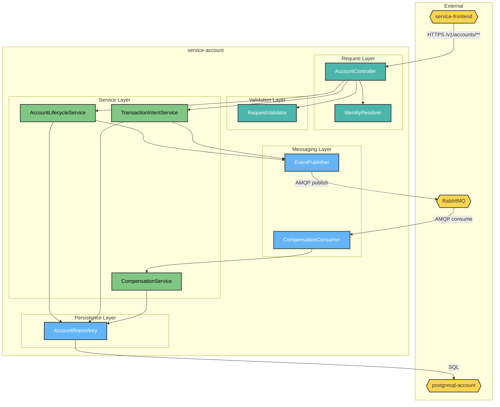
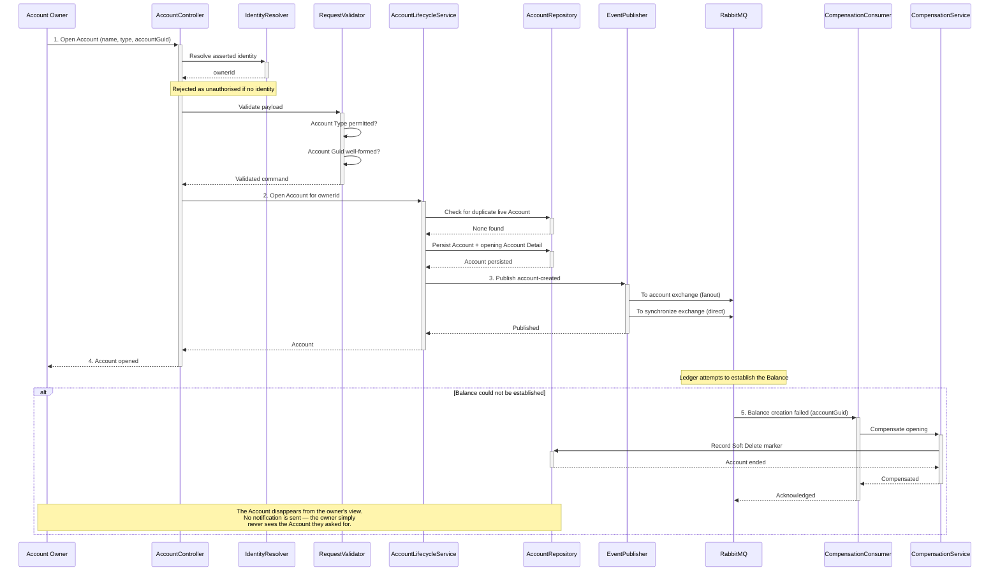
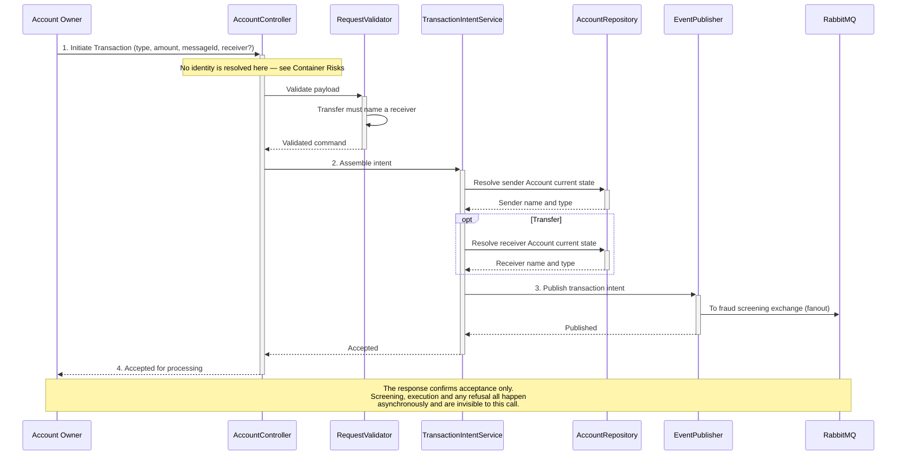

# HaboBanking - Container - Account Architecture

**Status:** Draft  
**Container:** service-account

---

## Table of Contents

1. [Overview](#overview)
2. [C4 Component Level](#c4-component-level)
3. [Domain Concepts to Component Mapping](#domain-concepts-to-component-mapping)
4. [Domain Concepts](#domain-concepts)
5. [Actions](#actions)
6. [Action Sequence Diagrams](#action-sequence-diagrams)
7. [Use Case Coverage Mapping](#use-case-coverage-mapping)
8. [Implementation Guide](#implementation-guide)
9. [Container Risks](#container-risks)
10. [Validation](#validation)

---

## Overview

`service-account` is the authoritative owner of the Account. It is the only container permitted to create, change or end an Account, and it is the customer's single command entry point — every instruction that changes state, including money movement, arrives here first and is then published onto RabbitMQ for asynchronous execution elsewhere.

### Container Purpose

- Own the authoritative record of Account, Account Detail and Account Type
- Expose the versioned REST command surface for all Account lifecycle operations
- Accept Transaction and Currency Exchange intents and publish them for screening
- Enforce Account-level business rules before any event is published
- Participate in the account-opening Saga as the initiator and as the Compensation executor
- Preserve a complete, append-only history — no Account row is ever updated or deleted

### Container Architectural Pattern

Layered Django application with an explicit service layer and messaging edges:

- **Request layer** — HTTP routing, JSON parsing, session identity extraction, status code selection
- **Validation layer** — DRF serializers performing schema and field-level validation
- **Service layer** — all business rules and orchestration; the only layer permitted to publish events
- **Persistence layer** — Django ORM models implementing the append-only pattern
- **Messaging layer** — a publisher for outbound events and a separate consumer process for Compensation

**Domain Path:** `habobanking.account`

---

## C4 Component Level



**Diagram Legend:** Yellow hexagons — external systems; teal — request layer; green — service layer; blue — persistence and messaging.

### C4 Component Overview

| Component name           | Domain Path                                    | Key responsibilities                                                                                                                                                                                                                          |
| ------------------------ | ---------------------------------------------- | --------------------------------------------------------------------------------------------------------------------------------------------------------------------------------------------------------------------------------------------- |
| AccountController        | `habobanking.account.accountcontroller`        | Route inbound HTTP commands to the correct operation; parse and shape request and response bodies; select HTTP status codes; delegate all decisions to the service layer                                                                      |
| IdentityResolver         | `habobanking.account.identityresolver`         | Extract the asserted Account Owner identity from the session credential and make it available to the request. **Currently invoked on Account creation only** — see [Container Risks](#container-risks)                                        |
| RequestValidator         | `habobanking.account.requestvalidator`         | Validate request shape and field values before any business rule runs: Account Type must be one of the permitted values, Account Guid must be a well-formed UUID, a Transfer must name a receiver Account, names must be within length limits |
| AccountLifecycleService  | `habobanking.account.accountlifecycleservice`  | Apply all Account business rules — duplicate detection, append-only state transition, Soft Delete — and publish the resulting lifecycle event. Sole authority over Account state                                                              |
| TransactionIntentService | `habobanking.account.transactionintentservice` | Resolve the sender and, for a Transfer, the receiver Account; assemble the Transaction or Currency Exchange intent; publish it for fraud screening. Changes no state of its own                                                               |
| CompensationService      | `habobanking.account.compensationservice`      | Execute the Saga Compensation when the Balance for a newly opened Account could not be established, by Soft Deleting the Account                                                                                                              |
| AccountRepository        | `habobanking.account.accountrepository`        | Read and write Account, Account Detail, Account Type and Soft Delete markers; resolve the current state of an Account as its newest Account Detail; exclude Soft Deleted Accounts from all reads                                              |
| EventPublisher           | `habobanking.account.eventpublisher`           | Wrap every outbound event in the standard Message Envelope with Message Type, timestamp and Message Id, and publish it to the correct exchange and routing key                                                                                |
| CompensationConsumer     | `habobanking.account.compensationconsumer`     | Subscribe to the balance-creation-failure signal and invoke CompensationService. Runs as a separate long-lived process from the HTTP surface                                                                                                  |

---

## Domain Concepts to Component Mapping

| Domain Concept | Component Name                      | Domain Path                                    | Implementation Notes                                                                                                                         |
| -------------- | ----------------------------------- | ---------------------------------------------- | -------------------------------------------------------------------------------------------------------------------------------------------- |
| Account        | AccountRepository                   | `habobanking.account.accountrepository`        | Persisted as a row holding only identity (Account Guid) and ownership. Deliberately carries no mutable attribute, so it never needs updating |
| Account Detail | AccountRepository                   | `habobanking.account.accountrepository`        | Persisted as a child row per state change. Current state is resolved as the newest row by timestamp. Never updated, never deleted            |
| Account Type   | RequestValidator, AccountRepository | `habobanking.account.requestvalidator`         | Seeded reference data. Validated on every create and reclassify; referenced by Account Detail                                                |
| Account Owner  | IdentityResolver                    | `habobanking.account.identityresolver`         | Not persisted as an entity. Present only as the owner identifier stored on the Account                                                       |
| Transaction    | TransactionIntentService            | `habobanking.account.transactionintentservice` | Not persisted here. Exists only as a published intent carrying the Message Id assigned by the client                                         |

**Concepts deliberately absent from this container:** Balance, Balance Detail, Audit, Fraud Verdict, Exchange Rate, Currency and Notification are owned elsewhere. This container publishes intents that cause them to change but holds no copy of any of them.

---

## Domain Concepts

### Account

#### Constraints

| Constraint                | Description                                                                                                                                              |
| ------------------------- | -------------------------------------------------------------------------------------------------------------------------------------------------------- |
| Unique identity           | Account Guid is unique across the container. Re-submitting an existing Account Guid is treated as a repeat of the original request, not as a new Account |
| Single owner              | An Account has exactly one Account Owner, fixed at creation and never transferable                                                                       |
| No duplicate live Account | An Account Owner may not hold two live Accounts sharing both the same name and the same Account Type                                                     |
| Immutable once ended      | A Soft Deleted Account cannot be renamed, reclassified, frozen, unfrozen or reopened                                                                     |
| Never physically removed  | No delete operation exists at the persistence layer                                                                                                      |

#### Attributes

| Attribute   | Description                             | Type   | Min | Max | Rules                                                                     |
| ----------- | --------------------------------------- | ------ | --- | --- | ------------------------------------------------------------------------- |
| accountGuid | Globally unique identity of the Account | UUID   | —   | —   | Required; must be a well-formed UUID; supplied by the client at creation  |
| ownerId     | Identifier of the owning Account Owner  | String | 1   | 255 | Required; taken from the asserted session identity; never client-supplied |

### Account Detail

#### Constraints

| Constraint          | Description                                                  |
| ------------------- | ------------------------------------------------------------ |
| Write-once          | An Account Detail is never modified after creation           |
| Always at least one | Every Account has an opening Account Detail created with it  |
| Ordered by time     | The newest Account Detail by timestamp defines current state |

#### Attributes

| Attribute   | Description                                          | Type        | Min | Max | Rules                                                               |
| ----------- | ---------------------------------------------------- | ----------- | --- | --- | ------------------------------------------------------------------- |
| name        | Account Owner's own label for the Account            | String      | 1   | 255 | Required; participates in the duplicate rule                        |
| accountType | Stated banking purpose                               | Enumeration | —   | —   | Required; one of Checking Account, Savings Account, Pension Account |
| isFrozen    | Whether money movement is intended to be immobilised | Boolean     | —   | —   | Required; defaults to false at opening                              |
| timestamp   | Moment this state came into effect                   | DateTime    | —   | —   | Required; set at creation; used for ordering                        |

---

## Actions

| Action                   | Purpose                                                              | Authentication Required | Authorization Scope        | Pre-conditions                                                                  | Post-conditions                                                         | Side Effects                                                       | External Dependencies       | SLA  | Idempotent                                                                                 | Error Handling Strategy                                                                            |
| ------------------------ | -------------------------------------------------------------------- | ----------------------- | -------------------------- | ------------------------------------------------------------------------------- | ----------------------------------------------------------------------- | ------------------------------------------------------------------ | --------------------------- | ---- | ------------------------------------------------------------------------------------------ | -------------------------------------------------------------------------------------------------- |
| OpenAccount              | Bring a new Account into existence for the asserted Account Owner    | **Yes**                 | Own Accounts               | Account Type must exist; no live Account with same name and type for this owner | Account and opening Account Detail persisted                            | Publishes account-created to the account and synchronize exchanges | PostgreSQL, RabbitMQ        | < 2s | **Yes** — repeat Account Guid returns the original result                                  | Reject duplicates and invalid types with a client error; reject a missing identity as unauthorised |
| RenameAccount            | Change the Account's display name                                    | **No — defect**         | **None enforced — defect** | Account must exist and not be Soft Deleted                                      | New Account Detail appended with the new name                           | Publishes account-updated to the synchronize exchange              | PostgreSQL, RabbitMQ        | < 2s | No                                                                                         | Reject unknown Account as not found; reject invalid payload as client error                        |
| ReclassifyAccount        | Change the Account's Account Type                                    | **No — defect**         | **None enforced — defect** | Account must exist; Account Type must exist                                     | New Account Detail appended with the new Account Type                   | Publishes account-updated                                          | PostgreSQL, RabbitMQ        | < 2s | No                                                                                         | As above                                                                                           |
| SetFrozenState           | Freeze or unfreeze the Account                                       | **No — defect**         | **None enforced — defect** | Account must exist and not be Soft Deleted                                      | New Account Detail appended with the new frozen state                   | Publishes account-status to the synchronize exchange               | PostgreSQL, RabbitMQ        | < 2s | Effectively — setting the same state again is harmless                                     | As above                                                                                           |
| CloseAccount             | End the Account's usable life                                        | **No — defect**         | **None enforced — defect** | Account must exist and not already be Soft Deleted                              | Soft Delete marker recorded; Account excluded from all subsequent reads | Publishes account-deleted to the account and synchronize exchanges | PostgreSQL, RabbitMQ        | < 2s | Yes — closing twice has no further effect                                                  | As above                                                                                           |
| InitiateTransaction      | Submit a Deposit, Withdrawal or Transfer for screening and execution | **No — defect**         | **None enforced — defect** | Sender Account must exist; a Transfer must name an existing receiver Account    | None — no state changes in this container                               | Publishes a transaction intent to the fraud screening exchange     | PostgreSQL (read), RabbitMQ | < 2s | Downstream only — the client-supplied Message Id makes execution idempotent, not this call | Reject unknown sender or receiver as not found; accept and acknowledge otherwise                   |
| InitiateExchange         | Submit a Currency Exchange for screening and execution               | **No — defect**         | **None enforced — defect** | Account must exist                                                              | None                                                                    | Publishes an exchange intent to the fraud screening exchange       | PostgreSQL (read), RabbitMQ | < 2s | Downstream only                                                                            | As above                                                                                           |
| CompensateAccountOpening | Reverse an Account whose Balance could not be established            | No — internal           | Internal message consumer  | A balance-creation-failure signal naming an existing Account                    | Account Soft Deleted                                                    | None — terminal step of the Saga                                   | PostgreSQL, RabbitMQ        | < 5s | Yes                                                                                        | Log and discard if the Account is already Soft Deleted                                             |

> The `Authentication Required` and `Authorization Scope` columns record **observed behaviour, not intended design**. Every operation except OpenAccount should require an authenticated Account Owner and be scoped to Accounts they own. See [Container Risks](#container-risks).

---

## Action Sequence Diagrams

### Open Account — happy path and Compensation



### Initiate Transaction



---

## Use Case Coverage Mapping

| Use Case                            | API Entry Point                          | Implementing Components                                                                                                | URS Requirement |
| :---------------------------------- | :--------------------------------------- | :--------------------------------------------------------------------------------------------------------------------- | :-------------- |
| Open an Account                     | `POST /v1/accounts/`                     | AccountController + IdentityResolver + RequestValidator + AccountLifecycleService + AccountRepository + EventPublisher | UC-AO-002       |
| Rename an Account                   | `PUT /v1/accounts/{guid}/`               | AccountController + RequestValidator + AccountLifecycleService + AccountRepository + EventPublisher                    | UC-AO-003       |
| Reclassify an Account               | `PUT /v1/accounts/{guid}/`               | AccountController + RequestValidator + AccountLifecycleService + AccountRepository + EventPublisher                    | UC-AO-004       |
| Freeze an Account                   | `PATCH /v1/accounts/{guid}/`             | AccountController + RequestValidator + AccountLifecycleService + AccountRepository + EventPublisher                    | UC-AO-005       |
| Unfreeze an Account                 | `PATCH /v1/accounts/{guid}/`             | AccountController + RequestValidator + AccountLifecycleService + AccountRepository + EventPublisher                    | UC-AO-006       |
| Close an Account                    | `DELETE /v1/accounts/{guid}/`            | AccountController + AccountLifecycleService + AccountRepository + EventPublisher                                       | UC-AO-007       |
| Deposit funds                       | `POST /v1/accounts/{guid}/transactions/` | AccountController + RequestValidator + TransactionIntentService + EventPublisher                                       | UC-AO-008       |
| Withdraw funds                      | `POST /v1/accounts/{guid}/transactions/` | AccountController + RequestValidator + TransactionIntentService + EventPublisher                                       | UC-AO-009       |
| Transfer funds                      | `POST /v1/accounts/{guid}/transactions/` | AccountController + RequestValidator + TransactionIntentService + AccountRepository + EventPublisher                   | UC-AO-010       |
| Exchange into a Target Currency     | `POST /v1/accounts/{guid}/exchanges/`    | AccountController + RequestValidator + TransactionIntentService + EventPublisher                                       | UC-AO-011       |
| Open an Account — Compensation path | Internal consumer                        | CompensationConsumer + CompensationService + AccountRepository                                                         | UC-AO-002       |

All nine components map to at least one use case.

---

## Implementation Guide

### Solution & Project Structure

```
service-account/
├── account_service/          # Django project — settings, root URL configuration
├── accounts/                 # Application module
│   ├── views.py              # AccountController, IdentityResolver
│   ├── serializers.py        # RequestValidator
│   ├── services.py           # AccountLifecycleService, TransactionIntentService, CompensationService
│   ├── models.py             # AccountRepository
│   ├── publishers.py         # EventPublisher
│   ├── consumers.py          # CompensationConsumer
│   ├── urls.py               # Route table
│   └── management/commands/  # Consumer process entry point
├── tests/integration/
├── Dockerfile
└── requirements.txt
```

### Project Configuration Standards

| Property          | Value                                                    |
| ----------------- | -------------------------------------------------------- |
| Language          | Python 3.12                                              |
| Framework         | Django 5.0 with Django REST Framework                    |
| Server            | Gunicorn                                                 |
| Database          | PostgreSQL 18 via psycopg2                               |
| Messaging         | pika (raw AMQP client)                                   |
| API documentation | drf-spectacular, served as OpenAPI schema and Swagger UI |

### Component Wiring

Django's app registry provides module wiring; there is no dependency injection container. The service layer is imported directly by views, and the publisher is imported by the service layer. The CompensationConsumer runs as a **separate process** started through a management command — it does not share a process with the HTTP surface, so both must be running for the Saga to complete.

### Configuration Management

All configuration is supplied as environment variables: the session signing key, RabbitMQ connection settings, and the exchange and routing key names. Exchange names have code-level defaults, so a misconfigured deployment fails silently by publishing to a default exchange rather than refusing to start.

### Testing Infrastructure

Integration tests run against a real PostgreSQL and a real RabbitMQ using Django's transactional test case, asserting both persisted state and published messages. Coverage is concentrated on Account creation; the lifecycle, transaction-intent and compensation paths are comparatively thin.

---

## Container Risks

| ID           | Risk                                                            | Severity     | Detail                                                                                                                                                                                                                                                                                                                                                                                                                                                                                                                                                                                                                                                                                                                                                                          |
| ------------ | --------------------------------------------------------------- | ------------ | ------------------------------------------------------------------------------------------------------------------------------------------------------------------------------------------------------------------------------------------------------------------------------------------------------------------------------------------------------------------------------------------------------------------------------------------------------------------------------------------------------------------------------------------------------------------------------------------------------------------------------------------------------------------------------------------------------------------------------------------------------------------------------- |
| **CR-ACC-1** | Five state-changing operations require no authentication at all | **Critical** | Only OpenAccount resolves the caller's identity. Rename, reclassify, freeze, close, initiate-transaction and initiate-exchange perform no identity extraction and no ownership comparison. Because there is no gateway in front of this container, an unauthenticated caller who knows or guesses an Account Guid can rename, freeze or close another person's Account — and, most seriously, initiate a Transfer **out of it**, since the owner identifier attached to the published intent is read from the Account record rather than from the caller. This is OWASP A01 Broken Access Control and is directly exploitable for theft. **Every one of these operations must resolve the caller identity and reject any request where it does not match the Account's owner.** |
| **CR-ACC-2** | Frozen state is recorded but never enforced                     | High         | SetFrozenState appends the frozen flag and publishes it, but InitiateTransaction and InitiateExchange do not consult it. A frozen Account can still have money moved out of it. This resolves an open question carried from HaboBanking-intended-use.md: **the freeze rule is currently not enforced anywhere in the platform.**                                                                                                                                                                                                                                                                                                                                                                                                                                                |
| **CR-ACC-3** | Debug mode and unrestricted host acceptance are hard-coded      | High         | The application is configured with debug output enabled and accepts requests for any host name. Debug mode returns stack traces and configuration detail on error. Both must be environment-driven and disabled outside local development                                                                                                                                                                                                                                                                                                                                                                                                                                                                                                                                       |
| **CR-ACC-4** | Closure does not consider the Balance                           | Medium       | CloseAccount records the Soft Delete without any check on remaining funds, resolving a second open question from the IUD: **funds in a closed Account are stranded.** The Balance is Soft Deleted alongside it and no refund or sweep path exists                                                                                                                                                                                                                                                                                                                                                                                                                                                                                                                               |
| **CR-ACC-5** | Publishing is not transactional with persistence                | Medium       | State is committed and the event published as separate steps. A failure between them leaves the Account persisted but unannounced — no Balance is ever created and no Compensation is triggered, because the failure signal only follows a message that was never sent                                                                                                                                                                                                                                                                                                                                                                                                                                                                                                          |

---

## Validation

| Invariant | Statement                                                     | Result                                                                                                                               |
| --------- | ------------------------------------------------------------- | ------------------------------------------------------------------------------------------------------------------------------------ |
| INV-005   | All Components in this CA exist in the SA Container Breakdown | ✅ **Pass** — all nine components decompose `service-account`, which is present in HaboBanking-solution-architecture.md              |
| INV-011   | Every entity in this CA exists in Domain Concepts             | ✅ **Pass** — Account, Account Detail, Account Type, Account Owner and Transaction are all defined in HaboBanking-domain-concepts.md |

**Confidence: ~90%.** Component decomposition, actions, rules and messaging are drawn directly from the source. The authorization findings were verified endpoint by endpoint.

**This artifact is in Draft status.** Review the content and set the Status to Approved when satisfied.

---

**End of Document**
