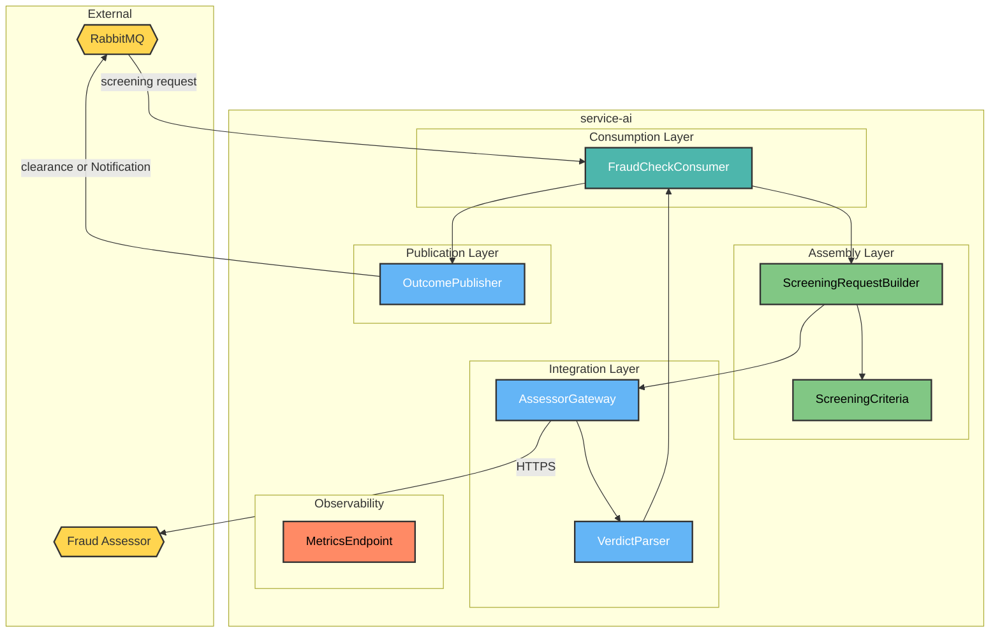
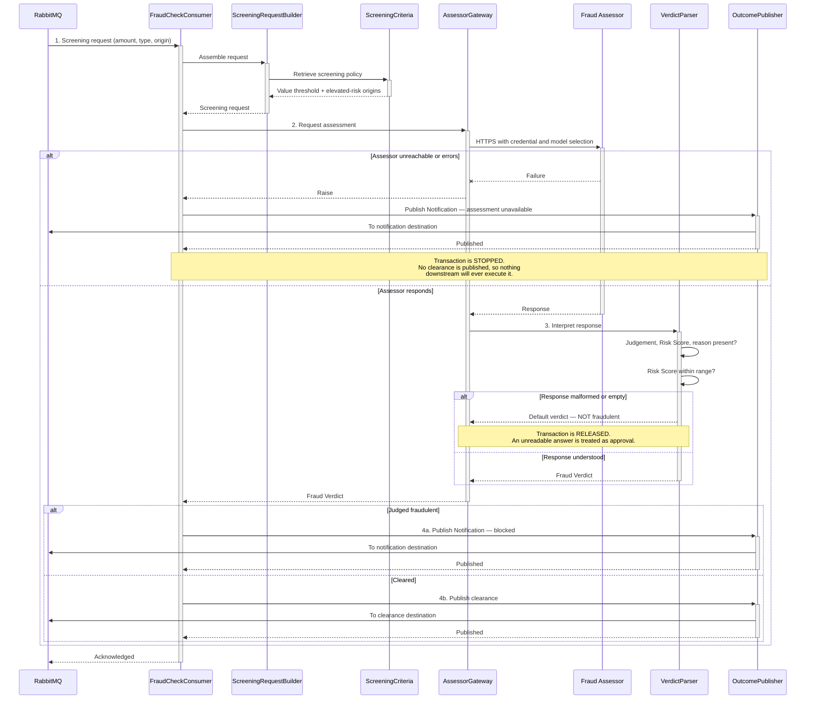

# HaboBanking - Container - Ai Architecture

**Status:** Draft  
**Container:** service-ai

---

## Table of Contents

1. [Overview](#overview)
2. [C4 Component Level](#c4-component-level)
3. [Domain Concepts to Component Mapping](#domain-concepts-to-component-mapping)
4. [Domain Concepts](#domain-concepts)
5. [Actions](#actions)
6. [Action Sequence Diagram](#action-sequence-diagram)
7. [Failure Behaviour](#failure-behaviour)
8. [Use Case Coverage Mapping](#use-case-coverage-mapping)
9. [Implementation Guide](#implementation-guide)
10. [Container Risks](#container-risks)
11. [Validation](#validation)

---

## Overview

`service-ai` enforces the platform's mandatory screening gate. Every Transaction of every Transaction Type passes through it before any Balance can change, and its decision is binary: publish a clearance that releases the Transaction, or publish a Notification that stops it.

It does not itself judge. It assembles the transaction facts, asks an external Fraud Assessor for a Fraud Verdict, and acts on the answer. Because the verdict is never retained, this container leaves no record of what it decided or why.

### Container Purpose

- Consume every Transaction and Currency Exchange intent before execution
- Assemble the screening request from the transaction facts
- Obtain a Fraud Verdict and Risk Score from the external Fraud Assessor
- Release a cleared Transaction for execution
- Stop a Transaction judged fraudulent and raise a Notification instead
- Expose operational metrics

### Container Architectural Pattern

Single-consumer worker wrapping one outbound integration:

- **Consumption layer** — the screening request subscription
- **Assembly layer** — screening criteria and request construction
- **Integration layer** — the external assessor client and response interpretation
- **Publication layer** — clearance or Notification
- **Observability layer** — metrics exposure

**Domain Path:** `habobanking.fraud`

---

## C4 Component Level



### C4 Component Overview

| Component name          | Domain Path                                 | Key responsibilities                                                                                                                                                  |
| ----------------------- | ------------------------------------------- | --------------------------------------------------------------------------------------------------------------------------------------------------------------------- |
| FraudCheckConsumer      | `habobanking.fraud.fraudcheckconsumer`      | Receive each screening request, sequence assembly, assessment and interpretation, and decide whether to release or stop the Transaction                               |
| ScreeningCriteria       | `habobanking.fraud.screeningcriteria`       | Hold the screening policy handed to the Fraud Assessor: the value threshold above which a Transaction is suspicious, and the network origins treated as elevated risk |
| ScreeningRequestBuilder | `habobanking.fraud.screeningrequestbuilder` | Assemble the screening request from the transaction facts — amount, Transaction Type and originating network location — together with the screening policy            |
| AssessorGateway         | `habobanking.fraud.assessorgateway`         | Call the external Fraud Assessor over HTTPS with the configured credential and model selection, and surface its response or its failure                               |
| VerdictParser           | `habobanking.fraud.verdictparser`           | Interpret the assessor's response into a Fraud Verdict — judgement, Risk Score and reason — and report when the response is absent, malformed or out of range         |
| OutcomePublisher        | `habobanking.fraud.outcomepublisher`        | Publish either a clearance releasing the Transaction, or a Notification stopping it                                                                                   |
| MetricsEndpoint         | `habobanking.fraud.metricsendpoint`         | Expose operational metrics for scraping                                                                                                                               |

---

## Domain Concepts to Component Mapping

| Domain Concept | Component Name                        | Domain Path                                 | Implementation Notes                                                                                                                                                                                  |
| -------------- | ------------------------------------- | ------------------------------------------- | ----------------------------------------------------------------------------------------------------------------------------------------------------------------------------------------------------- |
| Fraud Verdict  | VerdictParser                         | `habobanking.fraud.verdictparser`           | Constructed from the assessor's response and used immediately. **Never persisted** — this is where the concept's Global, unretained classification in HaboBanking-domain-concepts.md becomes concrete |
| Risk Score     | VerdictParser                         | `habobanking.fraud.verdictparser`           | Carried on the Fraud Verdict; expected within a bounded range and reported when outside it, but not itself acted upon                                                                                 |
| Fraud Check    | FraudCheckConsumer, ScreeningCriteria | `habobanking.fraud.fraudcheckconsumer`      | The screening activity. Applies to all four Transaction Types without exception                                                                                                                       |
| Transaction    | ScreeningRequestBuilder               | `habobanking.fraud.screeningrequestbuilder` | Received as an in-flight intent. Not persisted and not modified — only released or stopped                                                                                                            |
| Notification   | OutcomePublisher                      | `habobanking.fraud.outcomepublisher`        | Raised when a Transaction is stopped, whether by an adverse verdict or by an assessor failure                                                                                                         |
| Account        | ScreeningRequestBuilder               | `habobanking.fraud.screeningrequestbuilder` | Referenced by identity and name only, to describe the parties to the assessor                                                                                                                         |

---

## Domain Concepts

### Fraud Verdict

#### Constraints

| Constraint                  | Description                                                                             |
| --------------------------- | --------------------------------------------------------------------------------------- |
| Exactly one per Transaction | Every Transaction is screened once; the relationship has no zero case                   |
| Transient                   | Never stored, never queryable, never re-examinable after the fact                       |
| Externally authored         | The judgement originates outside the platform; this container only interprets it        |
| Binding                     | A judgement of fraudulent stops the Transaction with no override, review or appeal path |

#### Attributes

| Attribute | Description                                  | Type    | Min | Max | Rules                                                                                                        |
| --------- | -------------------------------------------- | ------- | --- | --- | ------------------------------------------------------------------------------------------------------------ |
| isFraud   | Whether the Transaction is judged fraudulent | Boolean | —   | —   | Required; determines release or stop. **Defaults to not-fraudulent when the response cannot be interpreted** |
| riskScore | Numeric measure of suspicion                 | Decimal | 0.0 | 1.0 | Expected within range; a value outside it is reported but not otherwise acted upon                           |
| reason    | Human-readable explanation                   | String  | —   | —   | Supplied by the assessor; carried into the Notification when the Transaction is stopped                      |

---

## Actions

| Action            | Purpose                                                           | Authentication Required | Authorization Scope  | Pre-conditions                                                                         | Post-conditions                                         | Side Effects                             | External Dependencies    | SLA  | Idempotent                                                                                              | Error Handling Strategy                                                 |
| ----------------- | ----------------------------------------------------------------- | ----------------------- | -------------------- | -------------------------------------------------------------------------------------- | ------------------------------------------------------- | ---------------------------------------- | ------------------------ | ---- | ------------------------------------------------------------------------------------------------------- | ----------------------------------------------------------------------- |
| ScreenTransaction | Obtain a Fraud Verdict and either release or stop the Transaction | No — internal consumer  | Broker-authenticated | A screening request carrying amount, Transaction Type and originating network location | None persisted — the Transaction is released or stopped | Publishes a clearance, or a Notification | Fraud Assessor, RabbitMQ | < 5s | **No** — each delivery calls the assessor again, and repeated deliveries may receive different verdicts | Divergent by failure mode — see [Failure Behaviour](#failure-behaviour) |

---

## Action Sequence Diagram

### Screen a Transaction



---

## Failure Behaviour

This container's failure behaviour resolves the open question carried from HaboBanking-intended-use.md and recorded as risk **AR-2** in HaboBanking-solution-architecture.md. **The answer is that the gate is neither consistently fail-closed nor fail-open — it is both, depending on how the assessor fails.**

| Failure mode                                             | Fraud Verdict used                   | Transaction outcome                                                  | Assessment                                                                           |
| -------------------------------------------------------- | ------------------------------------ | -------------------------------------------------------------------- | ------------------------------------------------------------------------------------ |
| Assessor unreachable, times out, or returns an error     | None obtained                        | **Stopped** — a Notification is raised and no clearance is published | **Fail-closed.** Correct and safe: money does not move when risk cannot be assessed  |
| Assessor responds but the response cannot be interpreted | Default verdict — **not fraudulent** | **Released** — a clearance is published                              | **Fail-open.** The Transaction proceeds unscreened because the answer was unreadable |
| Assessor responds with an out-of-range Risk Score        | Verdict used as given                | Released or stopped per the judgement                                | Reported but not acted upon                                                          |
| Assessor responds normally                               | Verdict as returned                  | Released or stopped per the judgement                                | Intended behaviour                                                                   |

The inconsistency matters. A reachable-but-degraded assessor — one returning truncated, rate-limited or altered-format responses — silently disables fraud screening across the entire platform while appearing healthy, because the transport-level call succeeded. Since Fraud Verdicts are not retained, there would be no record afterwards showing that a period of Transactions went unscreened. **This should be a deliberate, documented policy decision applied uniformly, not an artefact of which layer the failure surfaced in.**

---

## Use Case Coverage Mapping

| Use Case                                         | Trigger                             | Implementing Components                                                                            | URS Requirement |
| :----------------------------------------------- | :---------------------------------- | :------------------------------------------------------------------------------------------------- | :-------------- |
| Assess a Transaction                             | screening request                   | FraudCheckConsumer + ScreeningRequestBuilder + ScreeningCriteria + AssessorGateway + VerdictParser | UC-FA-001       |
| Deposit funds — screening gate                   | screening request                   | FraudCheckConsumer + OutcomePublisher                                                              | UC-AO-008       |
| Withdraw funds — screening gate                  | screening request                   | FraudCheckConsumer + OutcomePublisher                                                              | UC-AO-009       |
| Transfer funds — screening gate                  | screening request                   | FraudCheckConsumer + OutcomePublisher                                                              | UC-AO-010       |
| Exchange into a Target Currency — screening gate | screening request                   | FraudCheckConsumer + OutcomePublisher                                                              | UC-AO-011       |
| Receive a Notification — blocked Transaction     | adverse verdict or assessor failure | OutcomePublisher                                                                                   | UC-AO-014       |

`MetricsEndpoint` maps to no use case; it serves operations, the same acknowledged exception recorded in HaboBanking-solution-architecture.md.

---

## Implementation Guide

### Solution & Project Structure

```
service-ai/
├── Consumers/                # FraudCheckConsumer
├── Services/                 # AssessorGateway, VerdictParser, ScreeningCriteria
├── Messages/                 # Inbound and outbound contracts
├── Models/                   # Assessor request and response shapes, Fraud Verdict
├── Program.cs                # Host, messaging, HTTP client and metrics registration
├── docs/
├── service-ai.csproj
└── Dockerfile
```

### Project Configuration Standards

| Property             | Value                                                 |
| -------------------- | ----------------------------------------------------- |
| Framework            | .NET 9 worker                                         |
| Messaging            | MassTransit over RabbitMQ, raw JSON serialisation     |
| Outbound integration | Typed HTTP client with a bearer credential            |
| Metrics              | Exposed on a dedicated port for scraping              |
| Scaling              | Autoscaled on screening backlog, one to five replicas |

### Component Wiring

Registered at startup: the typed assessor client, the consumer, and the metrics server. The consumer binds its queue to the screening exchange, which is broadcast — so every replica competes for messages from the same queue rather than each receiving a copy.

### Configuration Management

Requires the assessor credential, the model selection and the broker connection settings. The screening policy — value threshold and elevated-risk origins — is **compiled into the container**, not configured, so tuning it requires a code change and redeployment.

### Testing Infrastructure

Integration tests cover the three consumer paths — cleared, judged fraudulent, and assessor failure — using a substituted assessor, plus live tests asserting response shape and threshold behaviour against the real assessor. The malformed-response path, which is the fail-open case, is **not** covered.

---

## Container Risks

| ID          | Risk                                                  | Severity     | Detail                                                                                                                                                                                                                                                                                                                                                                                                         |
| ----------- | ----------------------------------------------------- | ------------ | -------------------------------------------------------------------------------------------------------------------------------------------------------------------------------------------------------------------------------------------------------------------------------------------------------------------------------------------------------------------------------------------------------------- |
| **CR-AI-1** | A degraded assessor silently disables fraud screening | **Critical** | A response that cannot be interpreted yields a default verdict of not-fraudulent and the Transaction is released. An assessor that is reachable but returning altered, truncated or rate-limited responses therefore lets every Transaction through while appearing healthy. Combined with verdicts not being retained, there would be no evidence afterwards. **The default must be to stop, not to release** |
| **CR-AI-2** | Fraud Verdicts are never retained                     | **High**     | No record exists of what was decided, why, or with what Risk Score. Screening cannot be reported on, monitored across a customer's activity, audited, or appealed. This is the principal gap against the AMLD obligations noted in HaboBanking-intended-use.md                                                                                                                                                 |
| **CR-AI-3** | Screening is not idempotent                           | **High**     | Each delivery calls the assessor afresh. A redelivered request may receive a different verdict, so the same Transaction can be cleared on one attempt and stopped on another. There is no Message Id check before assessment, unlike every other consumer in the platform                                                                                                                                      |
| **CR-AI-4** | Screening policy is compiled in                       | Medium       | The value threshold and elevated-risk origins cannot be changed without a redeployment, so the platform cannot respond quickly to an emerging fraud pattern                                                                                                                                                                                                                                                    |
| **CR-AI-5** | Geographic origin is a weak and discriminatory signal | Medium       | Treating specific countries as elevated risk is trivially evaded with a proxy while penalising legitimate customers by location. It is also the kind of criterion likely to attract scrutiny under fairness and anti-discrimination expectations for automated decision-making                                                                                                                                 |
| **CR-AI-6** | No timeout is configured on the assessor call         | Medium       | The outbound call relies on the client default, which is long. A slow assessor holds a consumer for that whole period, and under load the backlog grows faster than autoscaling can absorb                                                                                                                                                                                                                     |
| **CR-AI-7** | Transaction facts are sent to a third party           | Medium       | Amount, Transaction Type, Account names and originating network location leave the platform on every Transaction. No data-processing agreement, minimisation or retention position for this flow was found                                                                                                                                                                                                     |
| **CR-AI-8** | An unrecoverable request has no defined destination   | Medium       | A request that fails repeatedly is neither cleared nor stopped, so the customer's instruction simply never completes and they are never told                                                                                                                                                                                                                                                                   |

---

## Validation

| Invariant | Statement                                                     | Result                                                                                                                                        |
| --------- | ------------------------------------------------------------- | --------------------------------------------------------------------------------------------------------------------------------------------- |
| INV-005   | All Components in this CA exist in the SA Container Breakdown | ✅ **Pass** — all seven components decompose `service-ai`                                                                                     |
| INV-011   | Every entity in this CA exists in Domain Concepts             | ✅ **Pass** — Fraud Verdict, Risk Score, Fraud Check, Transaction, Notification and Account are all defined in HaboBanking-domain-concepts.md |

**Confidence: ~90%.** Consumer, gateway, parser and criteria read directly from source. The divergent failure behaviour was traced through both exception paths and is corroborated by the existing tests.

**This artifact is in Draft status.** Review the content and set the Status to Approved when satisfied.

---

**End of Document**
