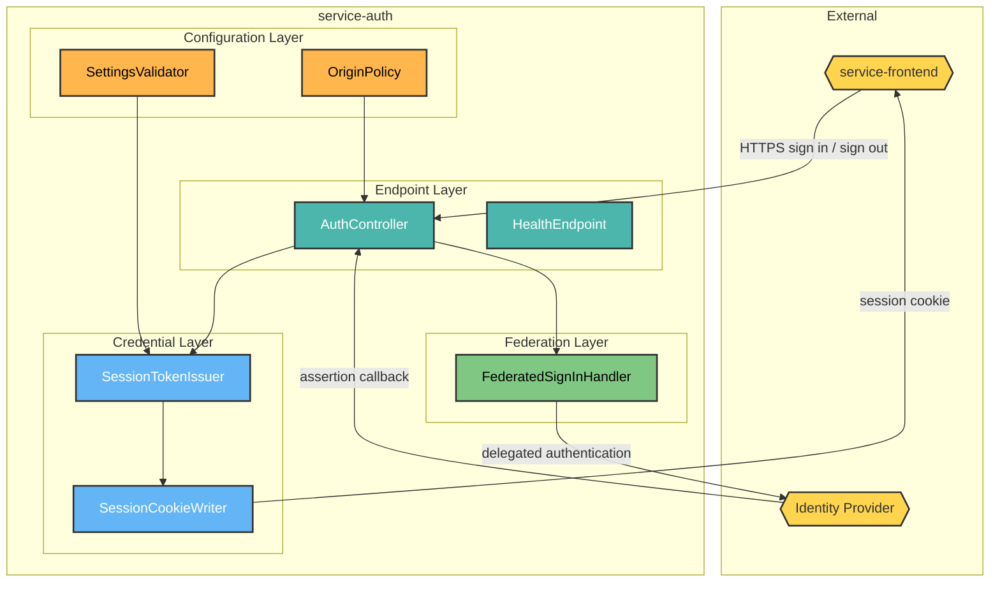
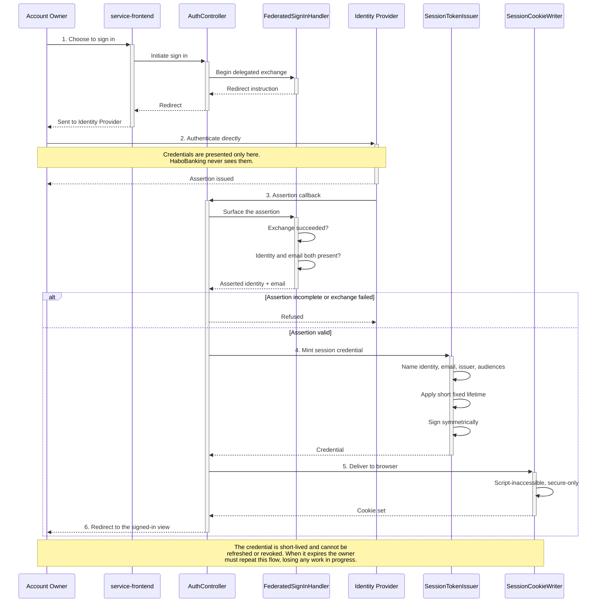

# HaboBanking - Container - Auth Architecture

**Status:** Draft  
**Container:** service-auth

---

## Table of Contents

1. [Overview](#overview)
2. [C4 Component Level](#c4-component-level)
3. [Domain Concepts to Component Mapping](#domain-concepts-to-component-mapping)
4. [Domain Concepts](#domain-concepts)
5. [Actions](#actions)
6. [Action Sequence Diagram](#action-sequence-diagram)
7. [Use Case Coverage Mapping](#use-case-coverage-mapping)
8. [Implementation Guide](#implementation-guide)
9. [Container Risks](#container-risks)
10. [Validation](#validation)

---

## Overview

`service-auth` is the platform's sole authentication boundary. It never sees a password: authentication is delegated to an external Identity Provider, and this container's job is to turn a successful external assertion into a session credential the rest of the platform can recognise.

It is entirely stateless. There is no user store, no session store, and no record that any particular person ever authenticated. That is a deliberate simplification with a consequence — an issued credential cannot be revoked before it expires.

### Container Purpose

- Initiate the delegated authentication exchange with the external Identity Provider
- Receive the provider's assertion and extract the Account Owner identity and email address
- Mint a short-lived session credential naming that identity
- Return the credential to the browser in a form that scripts cannot read
- Clear the credential on request
- Hold no credentials, no persistent identity record and no session state

### Container Architectural Pattern

Thin stateless web API with a single outbound federation dependency:

- **Endpoint layer** — the three HTTP operations and their responses
- **Federation layer** — the delegated authentication exchange and assertion handling
- **Credential layer** — session credential minting and browser delivery
- **Configuration layer** — startup validation of every required setting

**Domain Path:** `habobanking.auth`

---

## C4 Component Level



### C4 Component Overview

| Component name         | Domain Path                               | Key responsibilities                                                                                                                                                                                                    |
| ---------------------- | ----------------------------------------- | ----------------------------------------------------------------------------------------------------------------------------------------------------------------------------------------------------------------------- |
| AuthController         | `habobanking.auth.authcontroller`         | Expose the sign-in initiation, assertion callback and sign-out operations; sequence the federation, issuance and delivery steps; select response status and redirect destination                                        |
| FederatedSignInHandler | `habobanking.auth.federatedsigninhandler` | Initiate the delegated authentication exchange and, on return, surface the provider's assertion. Rejects the request when the exchange did not succeed or the assertion lacks an identity or email address              |
| SessionTokenIssuer     | `habobanking.auth.sessiontokenissuer`     | Mint the session credential carrying the asserted identity and email address, naming this container as issuer and the two command surfaces as intended audiences, with a fixed short lifetime and a symmetric signature |
| SessionCookieWriter    | `habobanking.auth.sessioncookiewriter`    | Deliver the credential to the browser as a cookie that scripts cannot read and that is only sent over a secure connection; clear the same cookie on sign-out                                                            |
| SettingsValidator      | `habobanking.auth.settingsvalidator`      | Verify at startup that every required setting is present and that the signing secret meets the minimum strength, refusing to start otherwise                                                                            |
| OriginPolicy           | `habobanking.auth.originpolicy`           | Permit credentialed cross-origin requests from the configured client origin only                                                                                                                                        |
| HealthEndpoint         | `habobanking.auth.healthendpoint`         | Report container liveness for orchestration                                                                                                                                                                             |

---

## Domain Concepts to Component Mapping

| Domain Concept | Component Name                             | Domain Path                           | Implementation Notes                                                                                                                                                                                                                                                                                 |
| -------------- | ------------------------------------------ | ------------------------------------- | ---------------------------------------------------------------------------------------------------------------------------------------------------------------------------------------------------------------------------------------------------------------------------------------------------- |
| Account Owner  | FederatedSignInHandler, SessionTokenIssuer | `habobanking.auth.sessiontokenissuer` | The only Domain Concept this container touches. It is never persisted — the container recognises an Account Owner from an external assertion and names them in a credential, nothing more. This is the concrete realisation of the concept being classified Global in HaboBanking-domain-concepts.md |

**No other Domain Concept is present in this container.** It holds no Account, no Balance and no Transaction, and it is the only customer-facing container of which that is true.

---

## Domain Concepts

### Account Owner

#### Constraints

| Constraint             | Description                                                                                                                      |
| ---------------------- | -------------------------------------------------------------------------------------------------------------------------------- |
| Externally established | The identity originates entirely from the Identity Provider; this container neither creates nor deletes it                       |
| Not persisted          | No record of an Account Owner is stored anywhere in this container                                                               |
| No roles               | The credential carries no role or permission claim, because the platform recognises exactly one human role                       |
| Session-bounded        | Recognition lasts only as long as the credential's short lifetime; there is no way to extend it without repeating authentication |

#### Attributes

| Attribute | Description                                                 | Type   | Min | Max | Rules                                                                                         |
| --------- | ----------------------------------------------------------- | ------ | --- | --- | --------------------------------------------------------------------------------------------- |
| identity  | Durable opaque identifier asserted by the Identity Provider | String | 1   | —   | Required; the assertion is rejected without it; becomes the owner identifier on every Account |
| email     | Address asserted by the Identity Provider                   | String | 1   | —   | Required; the assertion is rejected without it                                                |

---

## Actions

| Action         | Purpose                                                        | Authentication Required                      | Authorization Scope | Pre-conditions                                                                                                | Post-conditions                                  | Side Effects            | External Dependencies | SLA     | Idempotent                                        | Error Handling Strategy                                                                                                                                    |
| -------------- | -------------------------------------------------------------- | -------------------------------------------- | ------------------- | ------------------------------------------------------------------------------------------------------------- | ------------------------------------------------ | ----------------------- | --------------------- | ------- | ------------------------------------------------- | ---------------------------------------------------------------------------------------------------------------------------------------------------------- |
| InitiateSignIn | Begin delegated authentication                                 | No                                           | Public              | None                                                                                                          | Caller is redirected to the Identity Provider    | None                    | Identity Provider     | < 500ms | Yes                                               | Returns the redirect; failure surfaces at the provider                                                                                                     |
| CompleteSignIn | Turn a successful external assertion into a session credential | No — this is what establishes authentication | Public callback     | The delegated exchange must have succeeded and the assertion must carry both an identity and an email address | A session credential is delivered to the browser | Sets the session cookie | Identity Provider     | < 1s    | Yes — repeating produces an equivalent credential | Refuse as unauthorised when the exchange failed; refuse as a client error when the assertion is incomplete                                                 |
| SignOut        | End the browser session                                        | No                                           | Public              | None                                                                                                          | The session cookie is cleared                    | None                    | None                  | < 100ms | **Yes**                                           | Always succeeds — clearing an absent cookie is harmless. **Note: this clears the browser copy only; the credential itself remains valid until it expires** |
| ReportHealth   | Report liveness                                                | No                                           | Public              | None                                                                                                          | None                                             | None                    | None                  | < 50ms  | Yes                                               | Always responds while the process is running                                                                                                               |

---

## Action Sequence Diagram

### Authenticate an Account Owner



---

## Use Case Coverage Mapping

| Use Case                   | API Entry Point                           | Implementing Components                                                                                               | URS Requirement |
| :------------------------- | :---------------------------------------- | :-------------------------------------------------------------------------------------------------------------------- | :-------------- |
| Authenticate               | Sign-in initiation and assertion callback | AuthController + FederatedSignInHandler + SessionTokenIssuer + SessionCookieWriter + OriginPolicy + SettingsValidator | UC-AO-001       |
| Assert identity            | Assertion callback                        | FederatedSignInHandler                                                                                                | UC-IDP-001      |
| Authenticate — session end | Sign-out                                  | AuthController + SessionCookieWriter                                                                                  | UC-AO-001       |

`HealthEndpoint` maps to no use case; it serves orchestration rather than a business actor. This is the same acknowledged exception recorded against the observability container in HaboBanking-solution-architecture.md.

---

## Implementation Guide

### Solution & Project Structure

```
service-auth/
├── service-auth/
│   ├── Controllers/          # AuthController
│   ├── Services/             # SessionTokenIssuer and its abstraction
│   ├── Program.cs            # Bootstrap, OriginPolicy, HealthEndpoint, federation setup
│   ├── AppSettings.cs        # SettingsValidator contract
│   └── appsettings*.json
├── test/                     # SessionTokenIssuer tests
├── service-auth.slnx
└── Dockerfile
```

### Project Configuration Standards

| Property          | Value                                                           |
| ----------------- | --------------------------------------------------------------- |
| Framework         | ASP.NET Core on .NET 10                                         |
| Language          | C# with nullable reference types enabled                        |
| Federation        | OAuth 2.0 authorization code exchange with an external provider |
| Credential format | Symmetrically signed JSON Web Token                             |
| Persistence       | None — the container is entirely stateless                      |
| Exposed port      | 8080                                                            |

### Component Wiring

Registered through the built-in dependency injection container at startup: the settings model with validation applied at startup, the token issuer behind its interface, and the two authentication schemes — a cookie scheme for the browser session and the external provider scheme for federation.

### Configuration Management

Every setting is required and validated at startup, and the container refuses to start if any is missing or if the signing secret is below the minimum length. This is the strongest configuration discipline in the platform and is worth replicating elsewhere — several other containers fall back to development defaults instead of failing.

### Testing Infrastructure

Unit tests cover credential minting: structure, claims, signature, audiences, issuer, expiry, and rejection of a missing or too-short signing secret. There is no integration test of the federation exchange itself.

---

## Container Risks

| ID            | Risk                                                  | Severity | Detail                                                                                                                                                                                                                                                                                   |
| ------------- | ----------------------------------------------------- | -------- | ---------------------------------------------------------------------------------------------------------------------------------------------------------------------------------------------------------------------------------------------------------------------------------------- |
| **CR-AUTH-1** | Credentials cannot be revoked                         | **High** | The container is stateless with no revocation list. Sign-out clears the browser's copy but the credential remains valid until it expires. Anyone who has captured it can continue to act until then. The short lifetime bounds the exposure but does not remove it                       |
| **CR-AUTH-2** | The session lifetime is very short with no renewal    | **High** | The credential expires after a few minutes and there is no refresh mechanism. A customer part-way through a transaction can be interrupted and must re-authenticate, losing in-progress input. This trades usability heavily for a security benefit that revocation would deliver better |
| **CR-AUTH-3** | The credential names audiences that do not verify it  | **High** | The credential is issued naming the two command surfaces as intended audiences, but `service-account` accepts requests on five operations without inspecting it at all. The intent expressed here is not honoured downstream — see the Account container architecture, risk CR-ACC-1     |
| **CR-AUTH-4** | Symmetric signing shares one secret across containers | Medium   | The credential is signed with a shared secret that every verifying container must also hold. Any one of them being compromised allows forging credentials for all. Asymmetric signing would let verifiers hold only a public key                                                         |
| **CR-AUTH-5** | The cookie is delivered for cross-site use            | Medium   | The session cookie is configured to be sent on cross-site requests, which is necessary because the containers are served from different origins with no gateway. It widens exposure to cross-site request forgery, and no anti-forgery token was found on the state-changing surfaces    |
| **CR-AUTH-6** | No authentication events are recorded                 | Medium   | Nothing records that a person authenticated, from where, or how often. There is no audit trail of access to set against the otherwise thorough audit trail of money movement, and no way to detect credential abuse                                                                      |

---

## Validation

| Invariant | Statement                                                     | Result                                                                                                   |
| --------- | ------------------------------------------------------------- | -------------------------------------------------------------------------------------------------------- |
| INV-005   | All Components in this CA exist in the SA Container Breakdown | ✅ **Pass** — all seven components decompose `service-auth`                                              |
| INV-011   | Every entity in this CA exists in Domain Concepts             | ✅ **Pass** — Account Owner is defined in HaboBanking-domain-concepts.md and is the only concept present |

**Confidence: ~90%.** Small, well-structured container read directly from source, with configuration validation and token tests corroborating the described behaviour.

**This artifact is in Draft status.** Review the content and set the Status to Approved when satisfied.

---

**End of Document**
