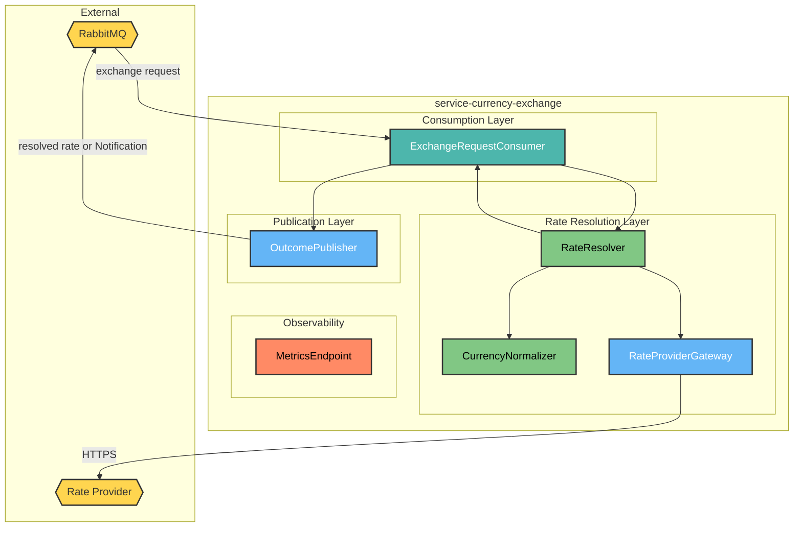
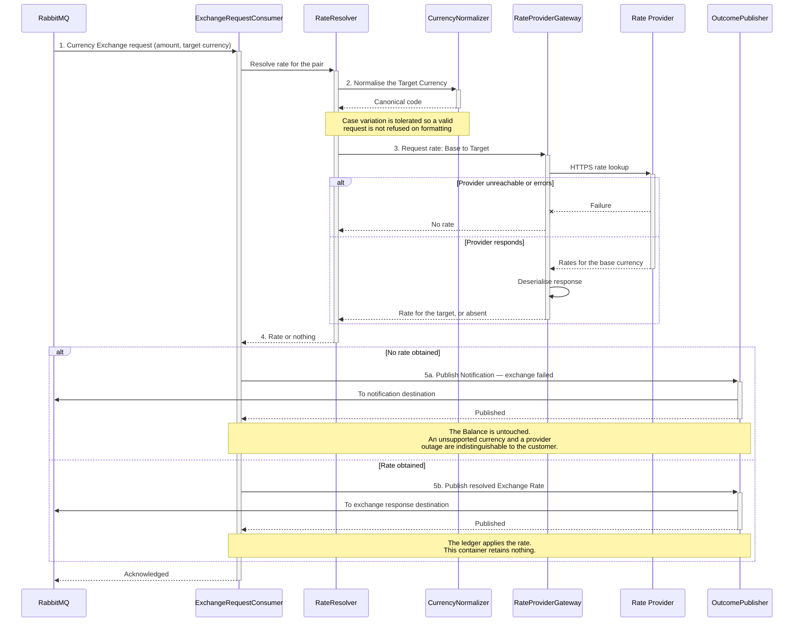

# HaboBanking - Container - CurrencyExchange Architecture

**Status:** Draft  
**Container:** service-currency-exchange

---

## Table of Contents

1. [Overview](#overview)
2. [C4 Component Level](#c4-component-level)
3. [Domain Concepts to Component Mapping](#domain-concepts-to-component-mapping)
4. [Domain Concepts](#domain-concepts)
5. [Actions](#actions)
6. [Action Sequence Diagram](#action-sequence-diagram)
7. [Use Case Coverage Mapping](#use-case-coverage-mapping)
8. [Implementation Guide](#implementation-guide)
9. [Container Risks](#container-risks)
10. [Validation](#validation)

---

## Overview

`service-currency-exchange` answers exactly one question: what is the Base Currency worth in a requested Target Currency, right now. It obtains the Exchange Rate from an external Rate Provider, publishes it back for application, and forgets it.

It never touches a Balance and never stores a rate. Its entire purpose is to keep the platform a consumer of market data rather than an authority on it — the reasoning being that a stale or invented rate applied to real money is a direct financial loss to one party.

### Container Purpose

- Consume Currency Exchange requests that have already cleared fraud screening
- Obtain the current Exchange Rate for the requested Currency pair
- Publish the resolved rate back for application to the Balance
- Raise a Notification when no rate can be obtained
- Hold no rate, no rate history and no supported-currency list
- Expose operational metrics

### Container Architectural Pattern

Single-consumer worker wrapping one outbound integration:

- **Consumption layer** — the exchange request subscription
- **Rate resolution layer** — currency normalisation and provider interaction
- **Publication layer** — resolved rate or Notification
- **Observability layer** — metrics exposure

**Domain Path:** `habobanking.currencyexchange`

---

## C4 Component Level



### C4 Component Overview

| Component name          | Domain Path                                                | Key responsibilities                                                                                                                                                                                                                    |
| ----------------------- | ---------------------------------------------------------- | --------------------------------------------------------------------------------------------------------------------------------------------------------------------------------------------------------------------------------------- |
| ExchangeRequestConsumer | `habobanking.currencyexchange.exchangerequestconsumer`     | Receive each Currency Exchange request, invoke rate resolution, and publish either the resolved Exchange Rate or a Notification explaining why none could be obtained                                                                   |
| CurrencyNormalizer      | `habobanking.currencyexchange.currencynormalizer`          | Normalise the requested Target Currency code to a canonical form so that case variation does not cause an otherwise valid request to fail                                                                                               |
| RateResolver            | `habobanking.currencyexchange.rateresolver`                | Obtain the Exchange Rate for the Base Currency to Target Currency pair, and determine whether a usable rate was returned. Reports absence rather than raising, so an unsupported Currency and a provider outage are handled identically |
| RateProviderGateway     | `habobanking.currencyexchange.rateproviderprovidergateway` | Call the external Rate Provider over HTTPS and deserialise its response into a rate per Currency                                                                                                                                        |
| OutcomePublisher        | `habobanking.currencyexchange.outcomepublisher`            | Publish the resolved Exchange Rate back for application, or publish a Notification when resolution failed                                                                                                                               |
| MetricsEndpoint         | `habobanking.currencyexchange.metricsendpoint`             | Expose operational metrics for scraping                                                                                                                                                                                                 |

> The domain path for `RateProviderGateway` should read `habobanking.currencyexchange.rateprovidergateway`; the duplication above is a naming slip to correct before approval.

---

## Domain Concepts to Component Mapping

| Domain Concept  | Component Name                    | Domain Path                                            | Implementation Notes                                                                                                                                                                                  |
| --------------- | --------------------------------- | ------------------------------------------------------ | ----------------------------------------------------------------------------------------------------------------------------------------------------------------------------------------------------- |
| Exchange Rate   | RateResolver, RateProviderGateway | `habobanking.currencyexchange.rateresolver`            | Obtained per request, published onward and immediately discarded. **Never stored** — this is where the concept's Global, unretained classification in HaboBanking-domain-concepts.md becomes concrete |
| Currency        | CurrencyNormalizer                | `habobanking.currencyexchange.currencynormalizer`      | Normalised but not validated against any list, because the platform holds none. Validity is discovered only by whether the provider quotes it                                                         |
| Base Currency   | RateProviderGateway               | `habobanking.currencyexchange.rateprovidergateway`     | Fixed as the currency every Balance is held in; always the source side of the pair                                                                                                                    |
| Target Currency | CurrencyNormalizer, RateResolver  | `habobanking.currencyexchange.rateresolver`            | The Currency named in the request; always the destination side of the pair                                                                                                                            |
| Notification    | OutcomePublisher                  | `habobanking.currencyexchange.outcomepublisher`        | Raised when no rate could be obtained, so the customer learns the exchange did not happen                                                                                                             |
| Transaction     | ExchangeRequestConsumer           | `habobanking.currencyexchange.exchangerequestconsumer` | Received as an in-flight Currency Exchange intent. Not persisted and not applied here                                                                                                                 |

---

## Domain Concepts

### Exchange Rate

#### Constraints

| Constraint                           | Description                                                         |
| ------------------------------------ | ------------------------------------------------------------------- |
| Resolved at the moment of use        | Obtained per request; never cached, so no stale rate can be applied |
| Never retained                       | No rate history exists anywhere in the platform                     |
| Always relative to the Base Currency | The source side of the pair is fixed                                |
| Absence is normal                    | An unobtainable rate is an expected outcome, not an exception       |

#### Attributes

| Attribute      | Description                                                  | Type    | Min | Max | Rules                                                            |
| -------------- | ------------------------------------------------------------ | ------- | --- | --- | ---------------------------------------------------------------- |
| rate           | Factor converting the Base Currency into the Target Currency | Decimal | > 0 | —   | Required when present; absence means the exchange cannot proceed |
| targetCurrency | The Currency being converted into                            | String  | 3   | 3   | Normalised to canonical form; not validated against any list     |

---

## Actions

| Action              | Purpose                                                                         | Authentication Required | Authorization Scope  | Pre-conditions                                                                           | Post-conditions | Side Effects                                            | External Dependencies   | SLA  | Idempotent                                                                                            | Error Handling Strategy                                                                                       |
| ------------------- | ------------------------------------------------------------------------------- | ----------------------- | -------------------- | ---------------------------------------------------------------------------------------- | --------------- | ------------------------------------------------------- | ----------------------- | ---- | ----------------------------------------------------------------------------------------------------- | ------------------------------------------------------------------------------------------------------------- |
| ResolveExchangeRate | Obtain the current rate for the requested Currency pair and publish the outcome | No — internal consumer  | Broker-authenticated | A Currency Exchange request naming a Target Currency, already cleared by fraud screening | None persisted  | Publishes the resolved Exchange Rate, or a Notification | Rate Provider, RabbitMQ | < 5s | **No** — each delivery obtains a fresh rate, so a redelivered request may resolve at a different rate | Unobtainable rate, unsupported Currency and provider failure all publish a Notification and stop the exchange |

---

## Action Sequence Diagram

### Resolve an Exchange Rate



---

## Use Case Coverage Mapping

| Use Case                                 | Trigger           | Implementing Components                                                           | URS Requirement |
| :--------------------------------------- | :---------------- | :-------------------------------------------------------------------------------- | :-------------- |
| Provide an Exchange Rate                 | exchange request  | ExchangeRequestConsumer + RateResolver + CurrencyNormalizer + RateProviderGateway | UC-RP-001       |
| Exchange into a Target Currency          | exchange request  | ExchangeRequestConsumer + RateResolver + OutcomePublisher                         | UC-AO-011       |
| Receive a Notification — failed exchange | unobtainable rate | OutcomePublisher                                                                  | UC-AO-014       |

`MetricsEndpoint` maps to no use case; it serves operations, the same acknowledged exception recorded in HaboBanking-solution-architecture.md.

---

## Implementation Guide

### Solution & Project Structure

```
service-currency-exchange/
├── Consumers/                # ExchangeRequestConsumer
├── Services/                 # RateResolver, CurrencyNormalizer, RateProviderGateway
├── Messages/                 # Inbound and outbound contracts
├── Models/                   # Provider response shapes
├── Program.cs                # Host, messaging, HTTP client and metrics registration
├── docs/
├── service-currency-exchange.csproj
└── Dockerfile
```

### Project Configuration Standards

| Property             | Value                                                            |
| -------------------- | ---------------------------------------------------------------- |
| Framework            | .NET 9 worker                                                    |
| Messaging            | MassTransit over RabbitMQ, raw JSON serialisation                |
| Outbound integration | Typed HTTP client against a public, unauthenticated rate service |
| Metrics              | Exposed on a dedicated port for scraping                         |
| Scaling              | Autoscaled on exchange request backlog, one to five replicas     |

### Component Wiring

Registered at startup: the typed provider client with its base address, the consumer, and the metrics server. The consumer binds its queue to the exchange with a direct routing key, so requests and responses travel over the same exchange with different keys.

### Configuration Management

Requires only the provider base address and the broker connection settings. The provider address has a code-level default, so a misconfigured deployment silently calls the public service directly rather than refusing to start.

### Testing Infrastructure

Integration tests cover the three consumer paths — rate resolved, rate unavailable, and resolver failure — with a substituted resolver, plus live tests against the real provider asserting a positive rate for a known Currency, absence for an unknown one, and case-insensitivity. The live tests require internet access to pass, which makes the suite environment-dependent.

---

## Container Risks

| ID          | Risk                                                                | Severity | Detail                                                                                                                                                                                                                                                                                              |
| ----------- | ------------------------------------------------------------------- | -------- | --------------------------------------------------------------------------------------------------------------------------------------------------------------------------------------------------------------------------------------------------------------------------------------------------- |
| **CR-FX-1** | An unsupported Currency and a provider outage are indistinguishable | **High** | Both produce an absent rate and the same customer-facing Notification. A customer whose exchange failed cannot tell whether they chose an unsupported Currency or the platform was temporarily unable to serve them, and operations cannot distinguish a spike in user error from a provider outage |
| **CR-FX-2** | No timeout is configured on the provider call                       | **High** | The outbound call relies on the client default, which is long. A slow provider holds a consumer for that period, and since the request has already been screened and accepted, the customer waits with no feedback                                                                                  |
| **CR-FX-3** | Resolution is not idempotent                                        | **High** | Each delivery obtains a fresh rate. A redelivered request converts at whatever rate is current at that moment, so the same customer instruction can produce a materially different amount depending on retry timing. Unlike the ledger, this container has no Message Id check                      |
| **CR-FX-4** | The rate is not retained for the customer's benefit                 | Medium   | The applied rate is recorded on the Audit, but the platform keeps no independent record of what the provider quoted. A disputed conversion cannot be verified against anything other than the Audit it produced                                                                                     |
| **CR-FX-5** | Single external dependency with no fallback                         | Medium   | One provider, no secondary source and no cached last-known rate. Provider unavailability disables Currency Exchange for the whole platform                                                                                                                                                          |
| **CR-FX-6** | No retry on a transient provider failure                            | Medium   | A momentary network failure produces a customer-facing failure immediately, with no brief retry that would likely have succeeded                                                                                                                                                                    |
| **CR-FX-7** | Component naming slip in this document                              | Low      | The `RateProviderGateway` domain path contains a duplicated segment; correct before approval                                                                                                                                                                                                        |

---

## Validation

| Invariant | Statement                                                     | Result                                                                                                                                                |
| --------- | ------------------------------------------------------------- | ----------------------------------------------------------------------------------------------------------------------------------------------------- |
| INV-005   | All Components in this CA exist in the SA Container Breakdown | ✅ **Pass** — all six components decompose `service-currency-exchange`                                                                                |
| INV-011   | Every entity in this CA exists in Domain Concepts             | ✅ **Pass** — Exchange Rate, Currency, Base Currency, Target Currency, Notification and Transaction are all defined in HaboBanking-domain-concepts.md |

**Confidence: ~90%.** Small container read directly from source, with consumer paths corroborated by tests.

**This artifact is in Draft status.** Review the content and set the Status to Approved when satisfied.

---

**End of Document**
