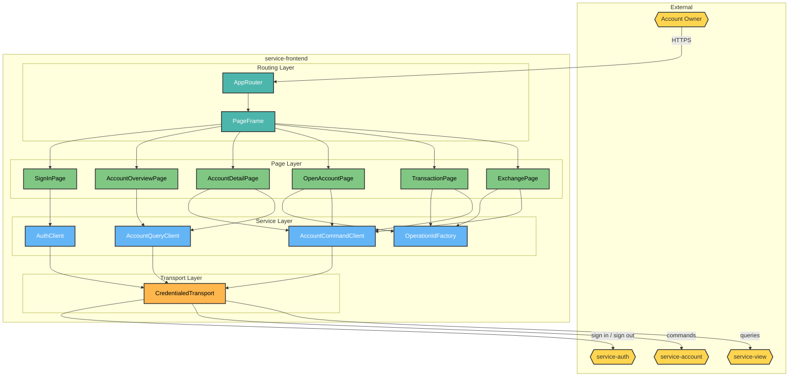
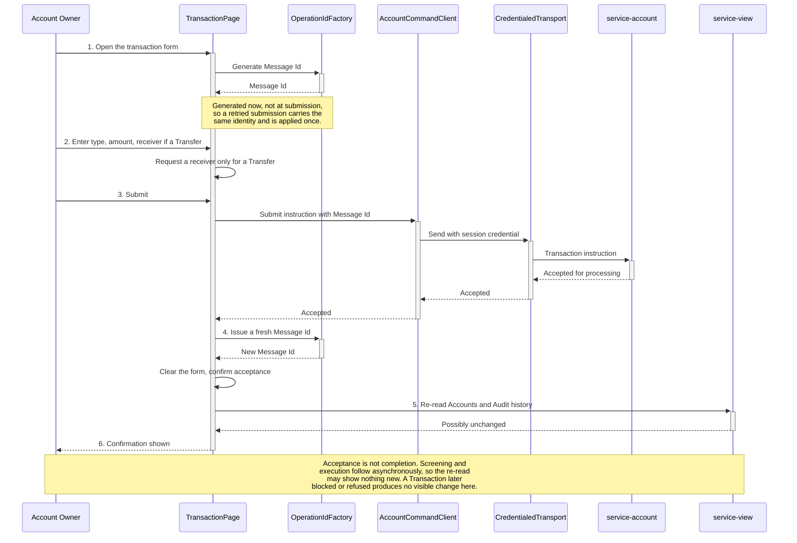

# HaboBanking - Container - Frontend Architecture

**Status:** Draft  
**Container:** service-frontend

---

## Table of Contents

1. [Overview](#overview)
2. [C4 Component Level](#c4-component-level)
3. [Domain Concepts to Component Mapping](#domain-concepts-to-component-mapping)
4. [Domain Concepts](#domain-concepts)
5. [Actions](#actions)
6. [Action Sequence Diagram](#action-sequence-diagram)
7. [Use Case Coverage Mapping](#use-case-coverage-mapping)
8. [Implementation Guide](#implementation-guide)
9. [Container Risks](#container-risks)
10. [Validation](#validation)

---

## Overview

`service-frontend` is the only container an Account Owner ever interacts with directly. It is a single-page application served as static assets, holding no business rules of its own — every rule it appears to apply is a convenience that the backend is expected to re-apply.

It has one genuinely load-bearing responsibility: it generates the identifiers that make operations idempotent. The Account Guid for a new Account and the Message Id for every Transaction and Currency Exchange are minted here, in the browser, before the request is sent. That is what allows a retried request to be recognised as a repeat rather than executed twice.

### Container Purpose

- Present Accounts, Balances and Audit history to the Account Owner
- Collect and submit Account lifecycle commands
- Collect and submit Transaction and Currency Exchange instructions
- Generate the Account Guid and Message Id that make those operations idempotent
- Carry the session credential on every request
- Hold no authoritative state and make no authorization decision

### Container Architectural Pattern

Route-driven single-page application with a thin service layer:

- **Routing layer** — route table and shared page frame
- **Page layer** — one component per route, owning its own local form state
- **Service layer** — typed clients for the command and query surfaces
- **Transport layer** — HTTP and GraphQL clients configured to carry the session credential

**Domain Path:** `habobanking.frontend`

---

## C4 Component Level



### C4 Component Overview

| Component name        | Domain Path                                  | Key responsibilities                                                                                                                                              |
| --------------------- | -------------------------------------------- | ----------------------------------------------------------------------------------------------------------------------------------------------------------------- |
| AppRouter             | `habobanking.frontend.approuter`             | Map browser routes to pages and provide the error boundary for unmatched or failed routes                                                                         |
| PageFrame             | `habobanking.frontend.pageframe`             | Provide the shared navigation frame and render the active page within it                                                                                          |
| SignInPage            | `habobanking.frontend.signinpage`            | Offer the sign-in entry point and hand the person to the authentication surface                                                                                   |
| AccountOverviewPage   | `habobanking.frontend.accountoverviewpage`   | Present every Account the Account Owner holds with its current Balance, and offer navigation into each                                                            |
| AccountDetailPage     | `habobanking.frontend.accountdetailpage`     | Present one Account with its Balance and Audit history, and offer rename, reclassify, freeze, unfreeze and close                                                  |
| OpenAccountPage       | `habobanking.frontend.openaccountpage`       | Collect a name and Account Type for a new Account and submit the opening command                                                                                  |
| TransactionPage       | `habobanking.frontend.transactionpage`       | Collect a Transaction Type, amount and — for a Transfer — a receiver, and submit the instruction                                                                  |
| ExchangePage          | `habobanking.frontend.exchangepage`          | Collect an amount and Target Currency and submit the Currency Exchange instruction                                                                                |
| AuthClient            | `habobanking.frontend.authclient`            | Initiate sign-in and request sign-out                                                                                                                             |
| AccountCommandClient  | `habobanking.frontend.accountcommandclient`  | Submit every state-changing command to the command surface                                                                                                        |
| AccountQueryClient    | `habobanking.frontend.accountqueryclient`    | Retrieve Accounts, Balances and Audit history from the query surface                                                                                              |
| OperationIdFactory    | `habobanking.frontend.operationidfactory`    | Generate the Account Guid for a new Account and the Message Id for each Transaction and Currency Exchange, and issue a fresh one after each successful submission |
| CredentialedTransport | `habobanking.frontend.credentialedtransport` | Ensure the session credential accompanies every outbound request to both surfaces                                                                                 |

---

## Domain Concepts to Component Mapping

| Domain Concept   | Component Name                         | Domain Path                                  | Implementation Notes                                                                                                             |
| ---------------- | -------------------------------------- | -------------------------------------------- | -------------------------------------------------------------------------------------------------------------------------------- |
| Account          | AccountOverviewPage, AccountDetailPage | `habobanking.frontend.accountoverviewpage`   | Presented from the query surface. Never authoritative — the browser holds a copy for display only                                |
| Account Guid     | OperationIdFactory                     | `habobanking.frontend.operationidfactory`    | **Generated in the browser** at the moment the opening form is first shown, which is what makes a repeated submission idempotent |
| Account Type     | OpenAccountPage, AccountDetailPage     | `habobanking.frontend.openaccountpage`       | Offered as a constrained choice. Re-validated by the command surface, which is the actual authority                              |
| Balance          | AccountOverviewPage, AccountDetailPage | `habobanking.frontend.accountoverviewpage`   | Displayed as supplied by the query surface; never computed here                                                                  |
| Audit            | AccountDetailPage                      | `habobanking.frontend.accountdetailpage`     | Displayed newest-first as the customer's transaction history                                                                     |
| Transaction      | TransactionPage                        | `habobanking.frontend.transactionpage`       | Assembled as an instruction and submitted. Never executed or persisted here                                                      |
| Transaction Type | TransactionPage                        | `habobanking.frontend.transactionpage`       | Offered as a constrained choice; determines whether a receiver is requested                                                      |
| Message Id       | OperationIdFactory                     | `habobanking.frontend.operationidfactory`    | **Generated in the browser** per instruction. This is the identifier the ledger uses to guarantee a Transaction is applied once  |
| Target Currency  | ExchangePage                           | `habobanking.frontend.exchangepage`          | Offered as a constrained list, though the platform itself holds no supported-currency list                                       |
| Account Owner    | CredentialedTransport                  | `habobanking.frontend.credentialedtransport` | Never held or read here. Identity travels only as the session credential, which scripts cannot read                              |

---

## Domain Concepts

### Message Id

#### Constraints

| Constraint                  | Description                                                                                                  |
| --------------------------- | ------------------------------------------------------------------------------------------------------------ |
| Generated before submission | Minted when the form is first shown, not when it is submitted, so a retried submission reuses the same value |
| One per instruction         | A fresh value is issued after each successful submission, so the next instruction is distinct                |
| Client-originated           | The platform accepts whatever the browser supplies; it is not issued or verified by any server               |

#### Attributes

| Attribute | Description                                                | Type | Min | Max | Rules                                                                   |
| --------- | ---------------------------------------------------------- | ---- | --- | --- | ----------------------------------------------------------------------- |
| messageId | Identity of the operation, used downstream for idempotency | UUID | —   | —   | Required; generated using the browser's cryptographic identifier source |

### Account (displayed)

#### Attributes

| Attribute | Description                   | Type        | Min | Max | Rules                                                     |
| --------- | ----------------------------- | ----------- | --- | --- | --------------------------------------------------------- |
| name      | Owner's label                 | String      | 1   | 255 | Collected on opening and rename                           |
| type      | Stated banking purpose        | Enumeration | —   | —   | Constrained to the three permitted Account Types          |
| balance   | Current amount                | Decimal     | —   | —   | Display only; supplied by the query surface               |
| isFrozen  | Whether the Account is frozen | Boolean     | —   | —   | Display and toggle only; enforcement is a backend concern |

---

## Actions

| Action                   | Purpose                                           | Authentication Required    | Authorization Scope                         | Pre-conditions                                                  | Post-conditions                                 | Side Effects                                                  | External Dependencies | SLA     | Idempotent                                          | Error Handling Strategy                                   |
| ------------------------ | ------------------------------------------------- | -------------------------- | ------------------------------------------- | --------------------------------------------------------------- | ----------------------------------------------- | ------------------------------------------------------------- | --------------------- | ------- | --------------------------------------------------- | --------------------------------------------------------- |
| SignIn                   | Hand the person to the authentication surface     | No                         | Public                                      | None                                                            | Session credential established on return        | Navigates away from the application                           | service-auth          | < 1s    | Yes                                                 | Surface the failure in the page                           |
| SignOut                  | End the browser session                           | Session credential carried | Own session                                 | None                                                            | Credential cleared; returned to the entry point | —                                                             | service-auth          | < 500ms | Yes                                                 | Return to the entry point regardless of outcome           |
| ViewAccounts             | Present the Account Owner's Accounts and Balances | Session credential carried | Own Accounts, enforced by the query surface | None                                                            | None                                            | —                                                             | service-view          | < 500ms | Yes                                                 | Present a loading state, then an error message on failure |
| ViewAccountDetail        | Present one Account with its Audit history        | Session credential carried | Own Accounts, enforced by the query surface | An Account must be selected                                     | None                                            | —                                                             | service-view          | < 500ms | Yes                                                 | As above                                                  |
| SubmitOpenAccount        | Submit a new Account for opening                  | Session credential carried | Own Accounts                                | A name and Account Type must be supplied                        | Account opened                                  | Generates and submits the Account Guid                        | service-account       | < 2s    | **Yes** — the Account Guid is stable across retries | Keep the form open and present the error                  |
| SubmitRenameOrReclassify | Submit a change of name or Account Type           | Session credential carried | **Not enforced by the command surface**     | An Account must be selected                                     | Account changed                                 | —                                                             | service-account       | < 2s    | No                                                  | Keep the form open and present the error                  |
| SubmitFreezeToggle       | Submit a freeze or unfreeze                       | Session credential carried | **Not enforced by the command surface**     | An Account must be selected                                     | Frozen state changed                            | —                                                             | service-account       | < 2s    | Effectively                                         | Revert the local state and present the error              |
| SubmitClose              | Submit an Account closure                         | Session credential carried | **Not enforced by the command surface**     | Explicit confirmation must be given                             | Account closed                                  | Navigates back to the overview                                | service-account       | < 2s    | Yes                                                 | Remain on the page and present the error                  |
| SubmitTransaction        | Submit a Deposit, Withdrawal or Transfer          | Session credential carried | **Not enforced by the command surface**     | An amount and Transaction Type; a Transfer must name a receiver | Accepted for processing                         | Generates and submits the Message Id, then issues a fresh one | service-account       | < 2s    | **Yes** — the Message Id is stable across retries   | Keep the form open and present the error                  |
| SubmitExchange           | Submit a Currency Exchange                        | Session credential carried | **Not enforced by the command surface**     | An amount and Target Currency                                   | Accepted for processing                         | Generates and submits the Message Id, then issues a fresh one | service-account       | < 2s    | **Yes**                                             | Keep the form open and present the error                  |

> The `Authorization Scope` notes record that the command surface does not enforce ownership on these operations. That is a defect in `service-account`, not in this container — see risk CR-ACC-1 in the Account container architecture.

---

## Action Sequence Diagram

### Submit a Transaction



---

## Use Case Coverage Mapping

| Use Case                        | Route                | Implementing Components                                     | URS Requirement |
| :------------------------------ | :------------------- | :---------------------------------------------------------- | :-------------- |
| Authenticate                    | Entry point          | SignInPage + AuthClient + CredentialedTransport             | UC-AO-001       |
| Open an Account                 | New Account route    | OpenAccountPage + OperationIdFactory + AccountCommandClient | UC-AO-002       |
| Rename an Account               | Account detail route | AccountDetailPage + AccountCommandClient                    | UC-AO-003       |
| Reclassify an Account           | Account detail route | AccountDetailPage + AccountCommandClient                    | UC-AO-004       |
| Freeze an Account               | Account detail route | AccountDetailPage + AccountCommandClient                    | UC-AO-005       |
| Unfreeze an Account             | Account detail route | AccountDetailPage + AccountCommandClient                    | UC-AO-006       |
| Close an Account                | Account detail route | AccountDetailPage + AccountCommandClient                    | UC-AO-007       |
| Deposit funds                   | Transaction route    | TransactionPage + OperationIdFactory + AccountCommandClient | UC-AO-008       |
| Withdraw funds                  | Transaction route    | TransactionPage + OperationIdFactory + AccountCommandClient | UC-AO-009       |
| Transfer funds                  | Transaction route    | TransactionPage + OperationIdFactory + AccountCommandClient | UC-AO-010       |
| Exchange into a Target Currency | Exchange route       | ExchangePage + OperationIdFactory + AccountCommandClient    | UC-AO-011       |
| View Accounts and Balances      | Overview route       | AccountOverviewPage + AccountQueryClient                    | UC-AO-012       |
| Review Audit history            | Account detail route | AccountDetailPage + AccountQueryClient                      | UC-AO-013       |

`AppRouter` and `PageFrame` support every route rather than mapping to a single use case. All thirteen components participate in at least one use case.

---

## Implementation Guide

### Solution & Project Structure

```
service-frontend/
├── src/
│   ├── main.tsx              # Bootstrap, query client provider
│   ├── routes.tsx            # AppRouter
│   ├── pages/                # PageFrame and the six pages
│   ├── components/           # Shared navigation and UI elements
│   ├── services/             # AuthClient, AccountCommandClient, AccountQueryClient, transport setup
│   └── types/                # Display contracts for Account and Audit
├── Dockerfile                # Build, then serve static assets
└── package.json
```

### Project Configuration Standards

| Property          | Value                                                           |
| ----------------- | --------------------------------------------------------------- |
| Framework         | React 19 with Vite 7                                            |
| Language          | TypeScript                                                      |
| Routing           | Declarative route table with nested routes under a shared frame |
| Query transport   | GraphQL client configured to include credentials                |
| Command transport | HTTP client configured to include credentials                   |
| Serving           | Static assets behind a lightweight web server                   |
| Exposed port      | 3000                                                            |

### Component Wiring

The application is wrapped once at bootstrap in the query client provider, with the route table rendered inside it. Both transports are configured at module level to include the session credential, so no page needs to think about authentication. Page state is local to each page; there is no global store.

### Configuration Management

The three backend surface addresses are supplied at **build time**, not at runtime. They are compiled into the bundle, so promoting the same image between environments is not possible — each environment requires its own build.

### Testing Infrastructure

Component tests run under the same toolchain as the build, with the three surface addresses supplied as test configuration. Coverage is reported in the build pipeline.

---

## Container Risks

| ID          | Risk                                                  | Severity | Detail                                                                                                                                                                                                                                                                                                                                                                                                  |
| ----------- | ----------------------------------------------------- | -------- | ------------------------------------------------------------------------------------------------------------------------------------------------------------------------------------------------------------------------------------------------------------------------------------------------------------------------------------------------------------------------------------------------------- |
| **CR-FE-1** | Backend addresses are compiled into the bundle        | **High** | The three surface addresses are build-time values, so the same artefact cannot be promoted from test to production — a separate build is required per environment, and the built image encodes its target. This defeats the usual guarantee that the tested artefact is the deployed one                                                                                                                |
| **CR-FE-2** | Acceptance is presented to the customer as success    | **High** | Submitting a Transaction shows a confirmation, but the response only means the instruction was accepted for screening. If it is later blocked or refused, nothing in the interface changes — and because Notifications do not currently reach customers, the customer is left believing a Transaction succeeded when it did not. The confirmation wording should distinguish acceptance from completion |
| **CR-FE-3** | The session expires without warning                   | **High** | The credential is short-lived with no renewal. A customer part-way through entering a Transaction can have it rejected on submission with no prior indication, losing their input. Nothing in the interface tracks or signals remaining session time                                                                                                                                                    |
| **CR-FE-4** | Read-after-write shows stale data                     | Medium   | Successful submission triggers an immediate re-read, but the Read Model is eventually consistent, so the re-read usually returns the state as it was. The customer sees their instruction apparently have no effect                                                                                                                                                                                     |
| **CR-FE-5** | No anti-forgery protection on state-changing requests | Medium   | The session cookie is configured for cross-site use because the surfaces sit on different origins with no gateway. Combined with the absence of an anti-forgery token, this leaves the command surface open to cross-site request forgery                                                                                                                                                               |
| **CR-FE-6** | Client-side constraints are presentational only       | Medium   | Account Types, Transaction Types and the Target Currency list are constrained in the interface. Account Type and Transaction Type are re-validated server-side; the Currency list is not backed by any platform list at all, so it can drift from what the Rate Provider actually quotes                                                                                                                |
| **CR-FE-7** | Amounts are handled as text                           | Medium   | Amounts are collected and submitted as text with no client-side numeric or precision validation, so malformed values reach the backend before being rejected                                                                                                                                                                                                                                            |
| **CR-FE-8** | Audit history is rendered unbounded                   | Low      | The full history is fetched and rendered with no pagination, so the detail page degrades as an Account accumulates activity                                                                                                                                                                                                                                                                             |

---

## Validation

| Invariant | Statement                                                     | Result                                                                                                                                                                                            |
| --------- | ------------------------------------------------------------- | ------------------------------------------------------------------------------------------------------------------------------------------------------------------------------------------------- |
| INV-005   | All Components in this CA exist in the SA Container Breakdown | ✅ **Pass** — all thirteen components decompose `service-frontend`                                                                                                                                |
| INV-011   | Every entity in this CA exists in Domain Concepts             | ✅ **Pass** — Account, Account Guid, Account Type, Balance, Audit, Transaction, Transaction Type, Message Id, Target Currency and Account Owner are all defined in HaboBanking-domain-concepts.md |

**Confidence: ~85%.** Routes, services, transports and identifier generation read directly from source. Slightly lower than the backend containers because presentation behaviour is harder to characterise definitively from code alone.

**This artifact is in Draft status.** Review the content and set the Status to Approved when satisfied.

---

**End of Document**
