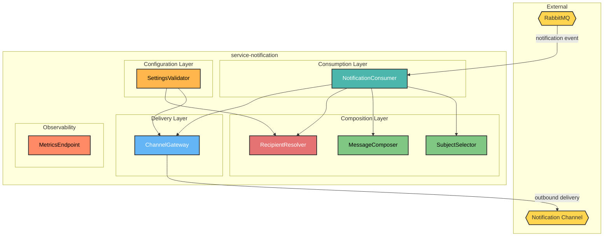
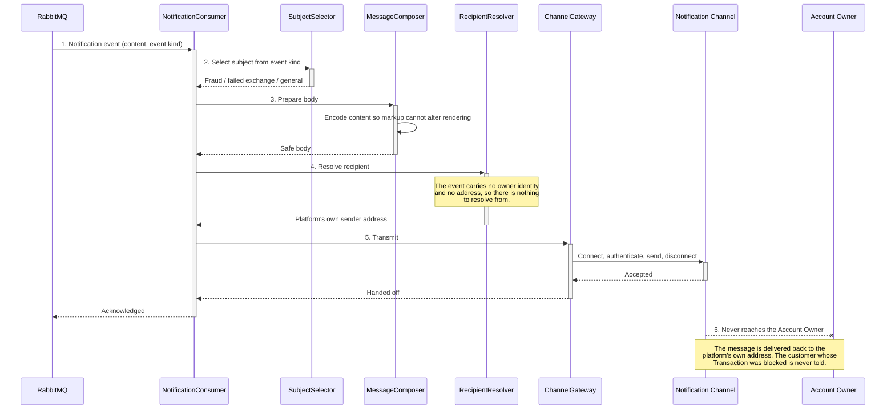

# HaboBanking - Container - Notification Architecture

**Status:** Draft  
**Container:** service-notification

---

## Table of Contents

1. [Overview](#overview)
2. [C4 Component Level](#c4-component-level)
3. [Domain Concepts to Component Mapping](#domain-concepts-to-component-mapping)
4. [Domain Concepts](#domain-concepts)
5. [Actions](#actions)
6. [Action Sequence Diagram](#action-sequence-diagram)
7. [Use Case Coverage Mapping](#use-case-coverage-mapping)
8. [Implementation Guide](#implementation-guide)
9. [Container Risks](#container-risks)
10. [Validation](#validation)

---

## Overview

`service-notification` is the platform's only outbound voice to the customer. When a Transaction is blocked, a Currency Exchange fails, or funds are insufficient, this container is what turns that outcome into a message a person actually receives.

It is stateless and fire-and-forget: it composes a message, hands it to the external Notification Channel, and retains nothing.

**This container does not currently deliver to the customer.** The recipient address is the platform's own configured sender address rather than the affected Account Owner's, so every Notification is delivered back to the platform. This is documented in full under [Container Risks](#container-risks) and it means the customer-facing use case this container exists to satisfy is, in practice, unimplemented.

### Container Purpose

- Consume Notification events raised anywhere in the platform
- Select an appropriate subject from the kind of event
- Compose a safe message body from the supplied content
- Hand the message to the external Notification Channel for delivery
- Expose operational metrics
- Persist nothing

### Container Architectural Pattern

Single-consumer worker wrapping one outbound integration:

- **Consumption layer** — the Notification subscription
- **Composition layer** — subject selection and body preparation
- **Delivery layer** — the outbound channel client
- **Configuration layer** — startup validation of every required setting
- **Observability layer** — metrics exposure

**Domain Path:** `habobanking.notification`

---

## C4 Component Level



**Diagram note:** `RecipientResolver` is shown in red because it is the defective component — see risk CR-NOT-1.

### C4 Component Overview

| Component name       | Domain Path                                     | Key responsibilities                                                                                                                                                                           |
| -------------------- | ----------------------------------------------- | ---------------------------------------------------------------------------------------------------------------------------------------------------------------------------------------------- |
| NotificationConsumer | `habobanking.notification.notificationconsumer` | Receive each Notification event and sequence subject selection, body composition, recipient resolution and delivery                                                                            |
| SubjectSelector      | `habobanking.notification.subjectselector`      | Choose the message subject from the kind of event — a suspected fraudulent Transaction, a failed Currency Exchange, or a general notice                                                        |
| MessageComposer      | `habobanking.notification.messagecomposer`      | Prepare the message body from the supplied content, encoding it so that markup carried in the content cannot alter the rendered message                                                        |
| RecipientResolver    | `habobanking.notification.recipientresolver`    | Determine the address the Notification should be delivered to. **Currently returns the platform's own configured sender address rather than the affected Account Owner's** — see risk CR-NOT-1 |
| ChannelGateway       | `habobanking.notification.channelgateway`       | Connect to the external Notification Channel over a secured connection, authenticate, transmit the message and disconnect                                                                      |
| SettingsValidator    | `habobanking.notification.settingsvalidator`    | Verify at startup that every required channel and broker setting is present, refusing to start otherwise                                                                                       |
| MetricsEndpoint      | `habobanking.notification.metricsendpoint`      | Expose operational metrics for scraping                                                                                                                                                        |

---

## Domain Concepts to Component Mapping

| Domain Concept   | Component Name                        | Domain Path                                     | Implementation Notes                                                                                                                                                        |
| ---------------- | ------------------------------------- | ----------------------------------------------- | --------------------------------------------------------------------------------------------------------------------------------------------------------------------------- |
| Notification     | NotificationConsumer, MessageComposer | `habobanking.notification.notificationconsumer` | Consumed as an event and composed into an outbound message. **Never persisted** — its lifecycle ends at hand-off, exactly as described in HaboBanking-domain-concepts.md    |
| Account Owner    | RecipientResolver                     | `habobanking.notification.recipientresolver`    | Should be the addressee. In practice the concept is absent from this container: the inbound event carries no owner identity or address, so there is nothing to resolve from |
| Transaction Type | SubjectSelector                       | `habobanking.notification.subjectselector`      | Used only to choose wording — a Deposit, Withdrawal or Transfer yields a fraud subject; a Currency Exchange yields a failed-exchange subject                                |

---

## Domain Concepts

### Notification

#### Constraints

| Constraint               | Description                                                                            |
| ------------------------ | -------------------------------------------------------------------------------------- |
| Raised on exception only | A successful routine Transaction produces none                                         |
| Not persisted            | No record is kept, so a customer cannot re-read a Notification they missed             |
| Delivery not tracked     | Hand-off to the channel ends this container's responsibility; success is not confirmed |
| Content is untrusted     | The body arrives from other containers and is encoded before rendering                 |

#### Attributes

| Attribute   | Description                                    | Type   | Min | Max | Rules                                                                          |
| ----------- | ---------------------------------------------- | ------ | --- | --- | ------------------------------------------------------------------------------ |
| message     | Body content describing what happened          | String | 1   | —   | Required; encoded before rendering so embedded markup cannot alter the message |
| messageType | The kind of event that raised the Notification | String | 1   | —   | Required; determines the subject                                               |
| messageId   | Identity of the originating operation          | UUID   | —   | —   | Required; carried but **not used for de-duplication**                          |
| recipient   | Address to deliver to                          | String | —   | —   | **Not present on the event.** This is the root of risk CR-NOT-1                |

---

## Actions

| Action              | Purpose                                                                    | Authentication Required | Authorization Scope  | Pre-conditions                                          | Post-conditions | Side Effects                                     | External Dependencies          | SLA  | Idempotent                                           | Error Handling Strategy                                                                                                                                                   |
| ------------------- | -------------------------------------------------------------------------- | ----------------------- | -------------------- | ------------------------------------------------------- | --------------- | ------------------------------------------------ | ------------------------------ | ---- | ---------------------------------------------------- | ------------------------------------------------------------------------------------------------------------------------------------------------------------------------- |
| DeliverNotification | Compose and hand off an outbound message describing an exceptional outcome | No — internal consumer  | Broker-authenticated | A Notification event carrying content and an event kind | None persisted  | Transmits a message through the external channel | Notification Channel, RabbitMQ | < 5s | **No** — a redelivered event sends the message again | A transmission failure surfaces to the messaging framework; **no explicit retry policy or failure destination was found**, so a persistently failing Notification is lost |

---

## Action Sequence Diagram

### Deliver a Notification



---

## Use Case Coverage Mapping

| Use Case                                         | Trigger            | Implementing Components                                                                       | URS Requirement                                                 |
| :----------------------------------------------- | :----------------- | :-------------------------------------------------------------------------------------------- | :-------------------------------------------------------------- |
| Deliver a Notification                           | notification event | NotificationConsumer + SubjectSelector + MessageComposer + RecipientResolver + ChannelGateway | UC-NC-001                                                       |
| Receive a Notification                           | notification event | All composition and delivery components                                                       | UC-AO-014 — ⚠️ **not satisfied in practice**, see risk CR-NOT-1 |
| Withdraw funds — refusal notice                  | insufficient funds | NotificationConsumer + SubjectSelector                                                        | UC-AO-009                                                       |
| Transfer funds — refusal notice                  | insufficient funds | NotificationConsumer + SubjectSelector                                                        | UC-AO-010                                                       |
| Exchange into a Target Currency — failure notice | unobtainable rate  | NotificationConsumer + SubjectSelector                                                        | UC-AO-011                                                       |

`SettingsValidator` and `MetricsEndpoint` map to no use case; they serve startup safety and operations respectively.

---

## Implementation Guide

### Solution & Project Structure

```
service-notification/
├── Consumers/                # NotificationConsumer, SubjectSelector, MessageComposer, RecipientResolver
├── Services/                 # ChannelGateway and its abstraction
├── Messages/                 # Notification contract
├── Settings/                 # Channel settings model
├── Program.cs                # Host, logging, messaging, settings validation, metrics
├── service-notification.Tests.Integration/
└── Dockerfile
```

### Project Configuration Standards

| Property          | Value                                                              |
| ----------------- | ------------------------------------------------------------------ |
| Framework         | .NET 9 worker                                                      |
| Messaging         | MassTransit over RabbitMQ, raw JSON serialisation, direct routing  |
| Outbound delivery | Mail client over an upgraded secure connection with authentication |
| Logging           | Structured logging to console and a rolling daily file             |
| Metrics           | Exposed on a dedicated port for scraping                           |
| Scaling           | Autoscaled on notification backlog, one to five replicas           |

### Component Wiring

Registered at startup: the channel settings, the gateway behind its abstraction, and the consumer. The consumer explicitly disables automatic topology binding and binds its own queue with a direct routing key, so it receives only messages addressed to it rather than everything published to the exchange.

### Configuration Management

Every channel and broker setting is required and the container refuses to start if any is missing. This matches the discipline in `service-auth` and is stronger than most containers in the platform.

### Testing Infrastructure

Integration tests cover message composition and subject selection using a capturing substitute for the channel, and exercise consumption against a containerised broker. **No test asserts who the message is addressed to**, which is precisely why the recipient defect has gone unnoticed.

---

## Container Risks

| ID           | Risk                                                             | Severity     | Detail                                                                                                                                                                                                                                                                                                                                                                                                                                                                                                                                                                                                                                                                                                                                                                                                          |
| ------------ | ---------------------------------------------------------------- | ------------ | --------------------------------------------------------------------------------------------------------------------------------------------------------------------------------------------------------------------------------------------------------------------------------------------------------------------------------------------------------------------------------------------------------------------------------------------------------------------------------------------------------------------------------------------------------------------------------------------------------------------------------------------------------------------------------------------------------------------------------------------------------------------------------------------------------------- |
| **CR-NOT-1** | Notifications are delivered to the platform, not to the customer | **Critical** | The recipient address is the platform's own configured sender address. Every Notification the platform raises — a Transaction blocked as fraudulent, a Currency Exchange that failed, a Withdrawal refused for insufficient funds — is delivered back to the platform's own mailbox. **The affected Account Owner is never told anything.** The root cause is upstream: the Notification event carries only body content and an event kind, with no owner identity and no address, so there is nothing for this container to resolve from. Fixing this requires the raising containers to include the Account Owner identity, and this container to obtain their address. Until then UC-AO-014 is unimplemented and the platform fails silently in exactly the situations the customer most needs to know about |
| **CR-NOT-2** | Delivery outcome is neither tracked nor retried                  | **High**     | The channel's response is received and discarded. Nothing records whether a message was delivered, and no retry or failure destination was found. A channel outage silently loses every Notification raised during it                                                                                                                                                                                                                                                                                                                                                                                                                                                                                                                                                                                           |
| **CR-NOT-3** | Notifications are not de-duplicated                              | Medium       | The originating Message Id is carried but never checked. A redelivered event sends the message again, so a customer could receive several copies of the same alert — once the recipient defect is fixed                                                                                                                                                                                                                                                                                                                                                                                                                                                                                                                                                                                                         |
| **CR-NOT-4** | Notification content is composed upstream                        | Medium       | Each raising container writes its own body text, so wording, tone and level of detail vary by source with no central control. A customer-facing message about their money is assembled in four different places                                                                                                                                                                                                                                                                                                                                                                                                                                                                                                                                                                                                 |
| **CR-NOT-5** | A connection is opened per message                               | Medium       | The gateway connects, authenticates, sends and disconnects for every Notification. Under a burst this is slow and may hit channel rate limits, which combined with the absence of retry means alerts are dropped precisely when volume is highest                                                                                                                                                                                                                                                                                                                                                                                                                                                                                                                                                               |
| **CR-NOT-6** | Only one channel exists                                          | Low          | Delivery is by a single medium with no alternative and no customer preference. A customer who cannot receive that medium has no way to be reached                                                                                                                                                                                                                                                                                                                                                                                                                                                                                                                                                                                                                                                               |

---

## Validation

| Invariant | Statement                                                     | Result                                                                                                           |
| --------- | ------------------------------------------------------------- | ---------------------------------------------------------------------------------------------------------------- |
| INV-005   | All Components in this CA exist in the SA Container Breakdown | ✅ **Pass** — all seven components decompose `service-notification`                                              |
| INV-011   | Every entity in this CA exists in Domain Concepts             | ✅ **Pass** — Notification, Account Owner and Transaction Type are all defined in HaboBanking-domain-concepts.md |

**Confidence: ~90%.** Consumer, composition and delivery read directly from source. The recipient defect was confirmed at the call site.

**This artifact is in Draft status.** Review the content and set the Status to Approved when satisfied.

---

**End of Document**
