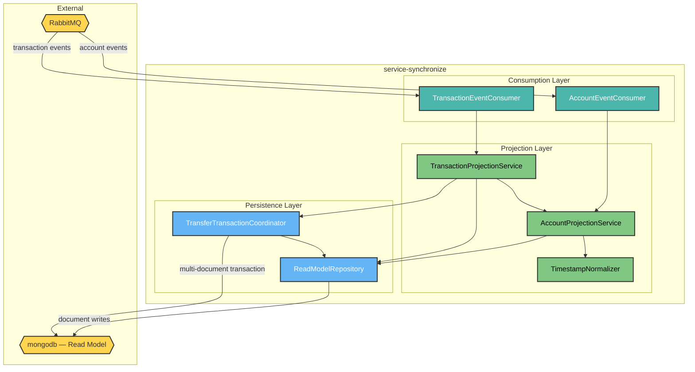
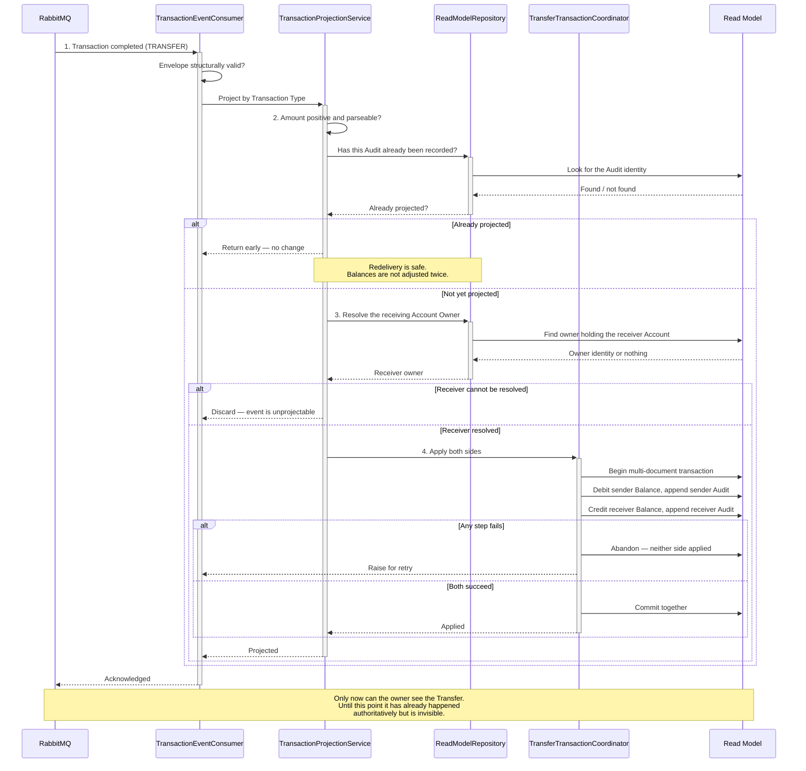

# HaboBanking - Container - Synchronize Architecture

**Status:** Draft  
**Container:** service-synchronize

---

## Table of Contents

1. [Overview](#overview)
2. [C4 Component Level](#c4-component-level)
3. [Domain Concepts to Component Mapping](#domain-concepts-to-component-mapping)
4. [Domain Concepts](#domain-concepts)
5. [Actions](#actions)
6. [Action Sequence Diagram](#action-sequence-diagram)
7. [Use Case Coverage Mapping](#use-case-coverage-mapping)
8. [Implementation Guide](#implementation-guide)
9. [Container Risks](#container-risks)
10. [Validation](#validation)

---

## Overview

`service-synchronize` is the bridge between what is true and what the customer can see. It consumes events from the two authoritative containers and maintains the Read Model — a single denormalised document per Account Owner containing every Account, Balance and Audit they hold.

It is the only writer of the Read Model, and it is the sole reason the customer's view exists at all. If it stops, money continues to move correctly and invisibly.

### Container Purpose

- Project Account lifecycle events into the Read Model
- Project completed Transactions into Balances and Audit history
- Apply a Transfer to both sides of the Read Model indivisibly
- Ensure a redelivered event produces no further change
- Reject an event that is older than the state it would overwrite
- Create the Account Owner's document on demand, since no container creates it explicitly

### Container Architectural Pattern

Consumer-per-stream with a service layer over a single repository:

- **Consumption layer** — one consumer per event stream, with a bounded retry policy
- **Projection layer** — services that interpret each event type and decide what changes
- **Persistence layer** — a single repository owning all document access, including the transactional path
- **Guard behaviour** — idempotency and ordering, applied within the projection and persistence layers

**Domain Path:** `habobanking.synchronize`

---

## C4 Component Level



### C4 Component Overview

| Component name                 | Domain Path                                              | Key responsibilities                                                                                                                                                                                                                            |
| ------------------------------ | -------------------------------------------------------- | ----------------------------------------------------------------------------------------------------------------------------------------------------------------------------------------------------------------------------------------------- |
| AccountEventConsumer           | `habobanking.synchronize.accounteventconsumer`           | Receive Account lifecycle events, determine which lifecycle change they represent, and delegate. Discard structurally invalid events; allow transient failures to be retried                                                                    |
| TransactionEventConsumer       | `habobanking.synchronize.transactioneventconsumer`       | Receive completed-Transaction events and delegate by Transaction Type. Same discard-versus-retry distinction                                                                                                                                    |
| AccountProjectionService       | `habobanking.synchronize.accountprojectionservice`       | Apply Account opening, rename, reclassification, freeze state and closure to the Read Model. Validate that the event names an Account Owner, carries an Account, and states a permitted Account Type                                            |
| TransactionProjectionService   | `habobanking.synchronize.transactionprojectionservice`   | Apply Deposit, Withdrawal, Currency Exchange and Transfer to projected Balances and append the Audit. Check idempotency before any change and resolve the receiving Account Owner for a Transfer                                                |
| TimestampNormalizer            | `habobanking.synchronize.timestampnormalizer`            | Parse and normalise event instants to a single canonical form, rejecting anything unparseable. Ordering decisions depend on this being consistent                                                                                               |
| ReadModelRepository            | `habobanking.synchronize.readmodelrepository`            | Own all Read Model access: create the Account Owner document on demand, add and remove Accounts, update projected Balances, append Audits, and determine whether an Audit has already been recorded. Reject stale updates by comparing instants |
| TransferTransactionCoordinator | `habobanking.synchronize.transfertransactioncoordinator` | Apply both sides of a Transfer within a single multi-document transaction, committing together or abandoning entirely. **This is the sole reason the document store must run as a replica set**                                                 |

---

## Domain Concepts to Component Mapping

| Domain Concept   | Component Name                                    | Domain Path                                            | Implementation Notes                                                                                                                                |
| ---------------- | ------------------------------------------------- | ------------------------------------------------------ | --------------------------------------------------------------------------------------------------------------------------------------------------- |
| Account Owner    | ReadModelRepository                               | `habobanking.synchronize.readmodelrepository`          | The Read Model document key. Created on demand the first time any Account event arrives for an identity — no container ever creates it deliberately |
| Account          | AccountProjectionService, ReadModelRepository     | `habobanking.synchronize.accountprojectionservice`     | Projected as a nested entry under its Account Owner. Closure removes the entry from the document rather than marking it                             |
| Account Type     | AccountProjectionService                          | `habobanking.synchronize.accountprojectionservice`     | Validated against the permitted set on projection; an unrecognised value discards the event                                                         |
| Balance          | TransactionProjectionService                      | `habobanking.synchronize.transactionprojectionservice` | Projected as an amount nested within each Account. Adjusted by each projected Transaction rather than recomputed                                    |
| Audit            | TransactionProjectionService, ReadModelRepository | `habobanking.synchronize.readmodelrepository`          | Appended to the Account's list. Its identity doubles as the idempotency key                                                                         |
| Transaction      | TransactionProjectionService                      | `habobanking.synchronize.transactionprojectionservice` | Not persisted. Consumed as an event; its effect persists as an adjusted Balance and an appended Audit                                               |
| Transaction Type | TransactionProjectionService                      | `habobanking.synchronize.transactionprojectionservice` | The dispatch key. Currency Exchange is projected identically to a Withdrawal, since both debit a single Account                                     |

---

## Domain Concepts

### Read Model document (Account Owner projection)

#### Constraints

| Constraint                 | Description                                                                      |
| -------------------------- | -------------------------------------------------------------------------------- |
| One per Account Owner      | A single document holds every Account, Balance and Audit for one identity        |
| Created on demand          | Brought into existence by the first Account event for that identity              |
| Derived only               | Contains nothing not derivable from the authoritative stores; safe to rebuild    |
| Eventually consistent      | Lags the authoritative record by the time it takes to consume and apply an event |
| Last-write-wins by instant | An event older than the projected state is discarded rather than applied         |

#### Attributes

| Attribute          | Description                           | Type    | Min | Max | Rules                                                                           |
| ------------------ | ------------------------------------- | ------- | --- | --- | ------------------------------------------------------------------------------- |
| ownerId            | Identity of the Account Owner         | String  | 1   | —   | Required; the document key; event is discarded if absent                        |
| accounts           | Projected Accounts held by this owner | List    | 0   | —   | Empty for a newly created document                                              |
| accounts[].balance | Projected current amount              | Decimal | —   | —   | Adjusted per projected Transaction. **Not constrained to be non-negative here** |
| accounts[].audits  | Projected Audit history               | List    | 0   | —   | Append-only; grows without bound                                                |

---

## Actions

| Action                        | Purpose                                            | Authentication Required | Authorization Scope  | Pre-conditions                                                                    | Post-conditions                                                                                       | Side Effects                                              | External Dependencies | SLA  | Idempotent                                           | Error Handling Strategy                                                                                                    |
| ----------------------------- | -------------------------------------------------- | ----------------------- | -------------------- | --------------------------------------------------------------------------------- | ----------------------------------------------------------------------------------------------------- | --------------------------------------------------------- | --------------------- | ---- | ---------------------------------------------------- | -------------------------------------------------------------------------------------------------------------------------- |
| ProjectAccountOpening         | Make a newly opened Account visible                | No — internal           | Broker-authenticated | Event names an Account Owner and carries an Account with a permitted Account Type | Account appears in the owner's document with a zero Balance and no Audits; document created if absent | None                                                      | MongoDB               | < 2s | **Yes** — re-projecting the same opening is harmless | Structurally invalid events are logged and discarded; transient failures retried three times                               |
| ProjectAccountUpdate          | Reflect a rename or reclassification               | No — internal           | Broker-authenticated | Account must already be projected; instant must be newer than projected state     | Projected name and Account Type updated                                                               | None                                                      | MongoDB               | < 2s | Yes                                                  | A stale event is discarded silently                                                                                        |
| ProjectFrozenState            | Reflect a freeze or unfreeze                       | No — internal           | Broker-authenticated | As above                                                                          | Projected frozen state updated                                                                        | None                                                      | MongoDB               | < 2s | Yes                                                  | As above                                                                                                                   |
| ProjectAccountClosure         | Remove a closed Account from view                  | No — internal           | Broker-authenticated | Event names an existing projected Account                                         | Account entry removed from the owner's document                                                       | **Destroys the projected Audit history for that Account** | MongoDB               | < 2s | Yes                                                  | As above                                                                                                                   |
| ProjectSingleSidedTransaction | Reflect a Deposit, Withdrawal or Currency Exchange | No — internal           | Broker-authenticated | Amount positive and parseable; Audit not already recorded                         | Projected Balance adjusted; Audit appended                                                            | None                                                      | MongoDB               | < 5s | **Yes** — via the Audit identity                     | Already-recorded Audit returns early; invalid amount discards the event                                                    |
| ProjectTransfer               | Reflect both sides of a Transfer indivisibly       | No — internal           | Broker-authenticated | Both parties resolvable; Audit not already recorded                               | Both projected Balances adjusted and both Audits appended, atomically                                 | None                                                      | MongoDB replica set   | < 5s | **Yes**                                              | The transaction is abandoned entirely on any failure and the event is retried; an unresolvable receiver discards the event |

---

## Action Sequence Diagram

### Project a Transfer — atomically across two owners



---

## Use Case Coverage Mapping

| Use Case                        | Trigger                                    | Implementing Components                                                                                        | URS Requirement |
| :------------------------------ | :----------------------------------------- | :------------------------------------------------------------------------------------------------------------- | :-------------- |
| Open an Account                 | account-created event                      | AccountEventConsumer + AccountProjectionService + TimestampNormalizer + ReadModelRepository                    | UC-AO-002       |
| Rename an Account               | account-updated event                      | AccountEventConsumer + AccountProjectionService + ReadModelRepository                                          | UC-AO-003       |
| Reclassify an Account           | account-updated event                      | AccountEventConsumer + AccountProjectionService + ReadModelRepository                                          | UC-AO-004       |
| Freeze an Account               | account-status event                       | AccountEventConsumer + AccountProjectionService + ReadModelRepository                                          | UC-AO-005       |
| Unfreeze an Account             | account-status event                       | AccountEventConsumer + AccountProjectionService + ReadModelRepository                                          | UC-AO-006       |
| Close an Account                | account-deleted event                      | AccountEventConsumer + AccountProjectionService + ReadModelRepository                                          | UC-AO-007       |
| Deposit funds                   | transaction-completed event                | TransactionEventConsumer + TransactionProjectionService + ReadModelRepository                                  | UC-AO-008       |
| Withdraw funds                  | transaction-completed event                | TransactionEventConsumer + TransactionProjectionService + ReadModelRepository                                  | UC-AO-009       |
| Transfer funds                  | transaction-completed event                | TransactionEventConsumer + TransactionProjectionService + TransferTransactionCoordinator + ReadModelRepository | UC-AO-010       |
| Exchange into a Target Currency | transaction-completed event                | TransactionEventConsumer + TransactionProjectionService + ReadModelRepository                                  | UC-AO-011       |
| View Accounts and Balances      | — supplies the data read by `service-view` | All components                                                                                                 | UC-AO-012       |
| Review Audit history            | — supplies the data read by `service-view` | All components                                                                                                 | UC-AO-013       |

All seven components map to at least one use case.

---

## Implementation Guide

### Solution & Project Structure

```
service-synchronize/
├── service-synchronize/
│   ├── Consumers/            # AccountEventConsumer, TransactionEventConsumer
│   ├── Services/             # AccountProjectionService, TransactionProjectionService, TimestampNormalizer
│   ├── Database/             # ReadModelRepository, TransferTransactionCoordinator
│   ├── Models/               # Projected document shapes
│   ├── Messages/             # Inbound event contracts
│   └── Program.cs            # Host, messaging and dependency registration
├── service-synchronize.tests/
├── service-synchronize.slnx
└── Dockerfile
```

### Project Configuration Standards

| Property     | Value                                                                  |
| ------------ | ---------------------------------------------------------------------- |
| Framework    | .NET 10 generic host console worker                                    |
| Messaging    | MassTransit over RabbitMQ, raw JSON serialisation                      |
| Data access  | Official MongoDB driver against MongoDB 7                              |
| Retry policy | Three attempts at five-second intervals; malformed data is not retried |
| Deployment   | Single replica — **not** autoscaled                                    |

### Component Wiring

Registered in the generic host: a single long-lived document store client, the repository, both projection services, and both consumers. Each consumer binds its own queue to the shared event exchange with its own routing key, so account and transaction streams are consumed independently.

### Configuration Management

Requires the Read Model connection string and the broker host. **The connection string must name a replica set** — with a standalone store the Transfer path fails at runtime rather than at startup, since multi-document transactions are unavailable outside a replica set.

### Testing Infrastructure

The best-tested .NET container. Unit tests cover projection mapping, validation, stale rejection, amount parsing and duplicate detection, with integration tests running against real infrastructure through containerised fixtures.

---

## Container Risks

| ID           | Risk                                                     | Severity | Detail                                                                                                                                                                                                                                                                                                                          |
| ------------ | -------------------------------------------------------- | -------- | ------------------------------------------------------------------------------------------------------------------------------------------------------------------------------------------------------------------------------------------------------------------------------------------------------------------------------- |
| **CR-SYN-1** | Single point of failure for everything the customer sees | **High** | This is the only writer of the Read Model and the only worker not autoscaled. If it stalls, money keeps moving authoritatively while every customer's view silently freezes. Nothing detects or reports the divergence                                                                                                          |
| **CR-SYN-2** | Closing an Account destroys its projected Audit history  | **High** | Closure removes the Account entry from the document, taking its Audits with it. The authoritative Audits survive in the ledger, but the customer permanently loses visibility of the history of a closed Account — which contradicts the intent recorded in UC-AO-007 and UC-AO-013, where closure is meant to preserve history |
| **CR-SYN-3** | Instants are compared as text                            | Medium   | Ordering decisions compare normalised instant strings rather than typed values. This is correct only while every producer formats identically; a producer emitting a different offset or precision would break ordering in a way that is hard to detect                                                                         |
| **CR-SYN-4** | Projected Balances are adjusted, not derived             | Medium   | Each event applies a delta to the projected amount rather than restating it. A single missed or wrongly-applied event leaves the projection permanently wrong with no self-correction, and no reconciliation against the authoritative ledger exists                                                                            |
| **CR-SYN-5** | Exhausted retries have no defined destination            | Medium   | After three failed attempts the event's fate is undefined. A persistently failing event is lost, leaving a permanent hole in the projection                                                                                                                                                                                     |
| **CR-SYN-6** | No metrics and no lag measurement                        | Medium   | Neither projection lag nor consumer health is exposed. The most important operational question about this container — how far behind is the customer's view — cannot be answered                                                                                                                                                |
| **CR-SYN-7** | The replica set has one member                           | Medium   | The replica set exists to enable the Transfer transaction, not for redundancy. Losing the single member halts all customer-facing reads                                                                                                                                                                                         |

---

## Validation

| Invariant | Statement                                                     | Result                                                                                                                                                                                                                                                 |
| --------- | ------------------------------------------------------------- | ------------------------------------------------------------------------------------------------------------------------------------------------------------------------------------------------------------------------------------------------------ |
| INV-005   | All Components in this CA exist in the SA Container Breakdown | ✅ **Pass** — all seven components decompose `service-synchronize`                                                                                                                                                                                     |
| INV-011   | Every entity in this CA exists in Domain Concepts             | ✅ **Pass** — Account Owner, Account, Account Type, Balance, Audit, Transaction and Transaction Type are all defined in HaboBanking-domain-concepts.md. The Read Model itself is documented there as an architectural projection rather than a concept |

**Confidence: ~90%.** Projection logic, transaction handling and guard behaviour read directly from source and corroborated by a thorough test suite.

**This artifact is in Draft status.** Review the content and set the Status to Approved when satisfied.

---

**End of Document**
