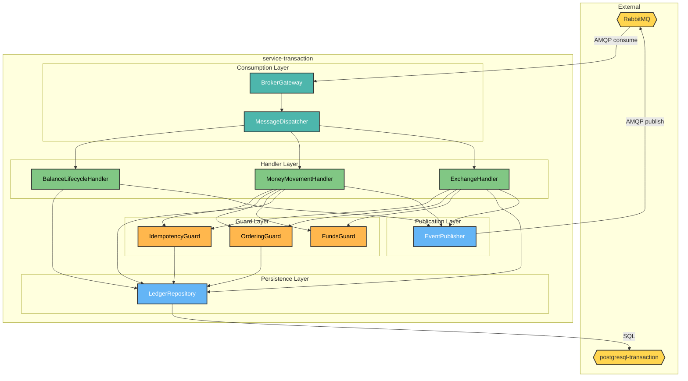
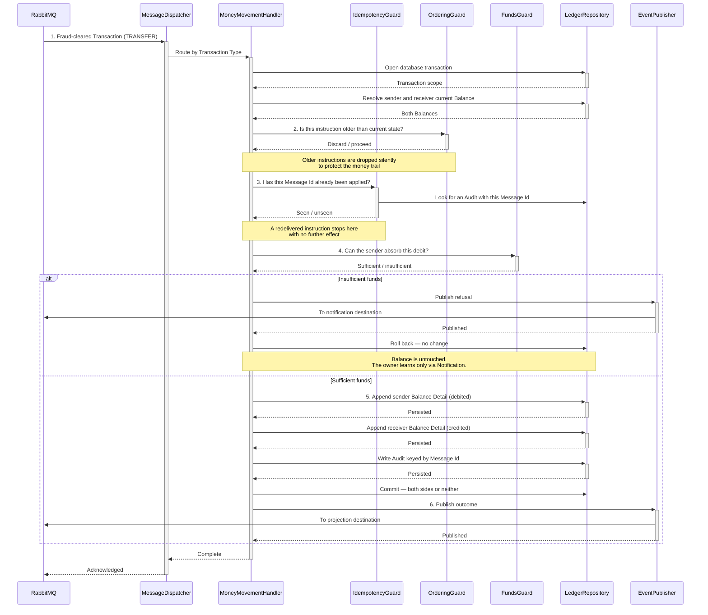

# HaboBanking - Container - Transaction Architecture

**Status:** Draft  
**Container:** service-transaction

---

## Table of Contents

1. [Overview](#overview)
2. [C4 Component Level](#c4-component-level)
3. [Domain Concepts to Component Mapping](#domain-concepts-to-component-mapping)
4. [Domain Concepts](#domain-concepts)
5. [Actions](#actions)
6. [Action Sequence Diagrams](#action-sequence-diagrams)
7. [Use Case Coverage Mapping](#use-case-coverage-mapping)
8. [Implementation Guide](#implementation-guide)
9. [Container Risks](#container-risks)
10. [Validation](#validation)

---

## Overview

`service-transaction` owns the money. It is the only container permitted to change a Balance, and it is where every business rule protecting the customer's funds is enforced — sufficient funds, idempotency, ordering, and the indivisibility of a Transfer. It has no HTTP surface at all: every operation is triggered by a message, and it only ever acts on a Transaction that has already cleared fraud screening.

### Container Purpose

- Own the authoritative record of Balance, Balance Detail and Audit
- Establish a Balance when an Account is opened, and signal failure so the Saga can compensate
- Apply Deposit, Withdrawal, Transfer and Currency Exchange to Balances
- Refuse any Transaction that would drive a Balance negative
- Guarantee that a redelivered instruction changes nothing further
- Write the immutable Audit that becomes the customer's transaction history
- Route Currency Exchange requests out for a rate and apply the rate that comes back

### Container Architectural Pattern

Message-driven pipeline with a thin dispatch layer over independent handlers:

- **Consumption layer** — broker connection, subscription, retry and dispatch by message type
- **Handler layer** — one handler per Transaction Type, each self-contained
- **Guard layer** — cross-cutting checks applied by every handler before acting
- **Persistence layer** — repository operations, each wrapped in a database transaction
- **Publication layer** — outbound events to projection, notification, exchange and compensation

**Domain Path:** `habobanking.transaction`

---

## C4 Component Level



**Diagram Legend:** Yellow hexagons — external systems; teal — consumption layer; green — handlers; orange — guards; blue — persistence and publication.

### C4 Component Overview

| Component name          | Domain Path                                       | Key responsibilities                                                                                                                                                   |
| ----------------------- | ------------------------------------------------- | ---------------------------------------------------------------------------------------------------------------------------------------------------------------------- |
| BrokerGateway           | `habobanking.transaction.brokergateway`           | Maintain the broker connection; declare and bind subscriptions; publish outbound messages; apply the bounded retry policy and surrender exhausted messages             |
| MessageDispatcher       | `habobanking.transaction.messagedispatcher`       | Inspect the Message Type or Transaction Type of each inbound message and route it to exactly one handler; trigger Saga compensation when a handler fails irrecoverably |
| BalanceLifecycleHandler | `habobanking.transaction.balancelifecyclehandler` | Establish a Balance at zero when an Account is opened and Soft Delete it when the Account is closed; publish the compensating signal if establishment fails            |
| MoneyMovementHandler    | `habobanking.transaction.moneymovementhandler`    | Apply Deposit, Withdrawal and Transfer to Balances; write the resulting Audit; publish the outcome for projection or a refusal for notification                        |
| ExchangeHandler         | `habobanking.transaction.exchangehandler`         | Forward a cleared Currency Exchange for rate resolution, then apply the returned Exchange Rate to the Balance and write the resulting Audit                            |
| IdempotencyGuard        | `habobanking.transaction.idempotencyguard`        | Determine whether a Message Id has already produced an Audit and, if so, stop the handler before any Balance changes                                                   |
| OrderingGuard           | `habobanking.transaction.orderingguard`           | Compare an instruction's timestamp against the newest Balance Detail and discard anything older, so out-of-order delivery cannot corrupt the money trail               |
| FundsGuard              | `habobanking.transaction.fundsguard`              | Determine whether a Balance can absorb a debit and refuse the operation when it cannot, ensuring a Balance never becomes negative                                      |
| LedgerRepository        | `habobanking.transaction.ledgerrepository`        | Read and write Balance, Balance Detail, Audit and Soft Delete markers within a database transaction; resolve current Balance as the newest Balance Detail              |
| EventPublisher          | `habobanking.transaction.eventpublisher`          | Wrap outcomes in the standard Message Envelope and publish to the projection, notification, currency-exchange and compensation destinations                            |

---

## Domain Concepts to Component Mapping

| Domain Concept   | Component Name                                           | Domain Path                                    | Implementation Notes                                                                                                                    |
| ---------------- | -------------------------------------------------------- | ---------------------------------------------- | --------------------------------------------------------------------------------------------------------------------------------------- |
| Balance          | LedgerRepository                                         | `habobanking.transaction.ledgerrepository`     | Persisted as a row holding identity and the owning Account Guid only. Carries no amount, so it never needs updating                     |
| Balance Detail   | LedgerRepository                                         | `habobanking.transaction.ledgerrepository`     | Persisted as a child row per amount change. Current amount is the newest row. Never updated, never deleted                              |
| Audit            | MoneyMovementHandler, ExchangeHandler, LedgerRepository  | `habobanking.transaction.ledgerrepository`     | Written once per successful Transaction, keyed by the Message Id — which is what makes the Audit table double as the idempotency record |
| Transaction      | MessageDispatcher, MoneyMovementHandler, ExchangeHandler | `habobanking.transaction.moneymovementhandler` | Never persisted as an entity. Exists as an in-flight message; its outcome persists as Balance Detail and Audit                          |
| Transaction Type | MessageDispatcher                                        | `habobanking.transaction.messagedispatcher`    | The dispatch key. Deposit, Withdrawal, Transfer and Currency Exchange each route to a distinct handler path                             |
| Exchange Rate    | ExchangeHandler                                          | `habobanking.transaction.exchangehandler`      | Received on an inbound message, applied immediately, recorded on the Audit and otherwise discarded                                      |
| Account          | LedgerRepository                                         | `habobanking.transaction.ledgerrepository`     | Referenced by Account Guid only. This container holds no Account attributes and is not authoritative for them                           |

---

## Domain Concepts

### Balance

#### Constraints

| Constraint                       | Description                                                                                          |
| -------------------------------- | ---------------------------------------------------------------------------------------------------- |
| One per Account                  | Exactly one Balance exists per Account Guid                                                          |
| Never negative                   | No operation may leave a Balance below zero; the platform extends no credit                          |
| Opens at zero                    | A newly established Balance always starts at zero                                                    |
| Denominated in the Base Currency | A Balance holds one currency only; Currency Exchange converts it rather than adding a second holding |
| Never physically removed         | Closure records a Soft Delete marker                                                                 |

#### Attributes

| Attribute   | Description                                                | Type   | Min | Max | Rules                            |
| ----------- | ---------------------------------------------------------- | ------ | --- | --- | -------------------------------- |
| accountGuid | The Account this Balance belongs to                        | UUID   | —   | —   | Required; unique across Balances |
| ownerId     | Denormalised owner identifier, carried for message routing | String | 1   | 255 | Required                         |

### Balance Detail

#### Attributes

| Attribute | Description                          | Type     | Min | Max | Rules                                                                    |
| --------- | ------------------------------------ | -------- | --- | --- | ------------------------------------------------------------------------ |
| amount    | The Balance amount as at this moment | Decimal  | 0   | —   | Required; must not be negative; **stored as text — see Container Risks** |
| createdAt | Moment this amount came into effect  | DateTime | —   | —   | Required; used by the OrderingGuard                                      |

### Audit

#### Constraints

| Constraint             | Description                                                               |
| ---------------------- | ------------------------------------------------------------------------- |
| Write-once             | Never modified or deleted, and it outlives the Soft Delete of its Account |
| Unique per Transaction | One Audit per Message Id; this uniqueness is the idempotency mechanism    |
| Two per Transfer       | A Transfer records the movement against both the sender and the receiver  |

#### Attributes

| Attribute         | Description                                                | Type        | Min | Max | Rules              |
| ----------------- | ---------------------------------------------------------- | ----------- | --- | --- | ------------------ |
| transactionId     | The originating Message Id                                 | UUID        | —   | —   | Required; unique   |
| amount            | Amount moved                                               | Decimal     | 0   | —   | Required; positive |
| transactionType   | Deposit, Withdrawal, Transfer or Currency Exchange         | Enumeration | —   | —   | Required           |
| senderBalanceId   | Balance debited, or the sole Balance for a Deposit         | Reference   | —   | —   | Required           |
| receiverBalanceId | Balance credited; equals the sender for non-Transfer types | Reference   | —   | —   | Required           |
| createdAt         | Moment the Transaction was applied                         | DateTime    | —   | —   | Required           |

---

## Actions

| Action              | Purpose                                                 | Authentication Required | Authorization Scope  | Pre-conditions                                                                                     | Post-conditions                                       | Side Effects                                     | External Dependencies | SLA  | Idempotent                                   | Error Handling Strategy                                                                   |
| ------------------- | ------------------------------------------------------- | ----------------------- | -------------------- | -------------------------------------------------------------------------------------------------- | ----------------------------------------------------- | ------------------------------------------------ | --------------------- | ---- | -------------------------------------------- | ----------------------------------------------------------------------------------------- |
| EstablishBalance    | Create the Balance for a newly opened Account           | No — internal consumer  | Broker-authenticated | An account-created message naming an Account with no existing Balance                              | Balance and opening Balance Detail at zero persisted  | Publishes account-created onward for projection  | PostgreSQL, RabbitMQ  | < 2s | **Yes** — an existing Balance short-circuits | On failure, publish the balance-creation-failure signal so the Account is compensated     |
| ReleaseBalance      | Soft Delete the Balance when its Account is closed      | No — internal           | Broker-authenticated | An account-deleted message naming an existing Balance                                              | Soft Delete marker recorded                           | Publishes account-deleted onward for projection  | PostgreSQL, RabbitMQ  | < 2s | Yes                                          | Already-released Balance is a no-op                                                       |
| ApplyDeposit        | Increase a Balance                                      | No — internal           | Broker-authenticated | Fraud Verdict cleared; Balance exists; Message Id unseen; instruction not older than current state | New Balance Detail and Audit persisted                | Publishes the outcome for projection             | PostgreSQL, RabbitMQ  | < 5s | **Yes** — via Message Id                     | Guard failures stop the handler silently; infrastructure failures roll back and redeliver |
| ApplyWithdrawal     | Decrease a Balance                                      | No — internal           | Broker-authenticated | As above, plus sufficient funds                                                                    | New Balance Detail and Audit persisted                | Publishes outcome, or a refusal for notification | PostgreSQL, RabbitMQ  | < 5s | **Yes**                                      | Insufficient funds publishes a Notification and makes no change                           |
| ApplyTransfer       | Move an amount between two Balances indivisibly         | No — internal           | Broker-authenticated | As above, plus both Balances exist and the sender has sufficient funds                             | Two Balance Details and an Audit persisted atomically | Publishes outcome for projection                 | PostgreSQL, RabbitMQ  | < 5s | **Yes**                                      | Both sides succeed or neither does — enforced by a single database transaction            |
| RequestExchangeRate | Forward a cleared Currency Exchange for rate resolution | No — internal           | Broker-authenticated | Fraud Verdict cleared; a Target Currency is named                                                  | None                                                  | Publishes an exchange request                    | RabbitMQ              | < 2s | No                                           | Malformed request is discarded                                                            |
| ApplyExchange       | Convert a Balance using a resolved Exchange Rate        | No — internal           | Broker-authenticated | An Exchange Rate and Target Currency present; Message Id unseen; sufficient funds                  | New Balance Detail and Audit persisted                | Publishes outcome, or a refusal for notification | PostgreSQL, RabbitMQ  | < 5s | **Yes**                                      | Missing rate or currency raises and redelivers; insufficient funds notifies               |

---

## Action Sequence Diagrams

### Apply Transfer — guards, atomicity and refusal



---

## Use Case Coverage Mapping

| Use Case                                         | Trigger                                       | Implementing Components                                                                                         | URS Requirement |
| :----------------------------------------------- | :-------------------------------------------- | :-------------------------------------------------------------------------------------------------------------- | :-------------- |
| Open an Account (Balance establishment and Saga) | account-created message                       | BrokerGateway + MessageDispatcher + BalanceLifecycleHandler + LedgerRepository + EventPublisher                 | UC-AO-002       |
| Close an Account (Balance release)               | account-deleted message                       | BalanceLifecycleHandler + LedgerRepository + EventPublisher                                                     | UC-AO-007       |
| Deposit funds                                    | fraud-cleared Transaction                     | MessageDispatcher + MoneyMovementHandler + IdempotencyGuard + OrderingGuard + LedgerRepository + EventPublisher | UC-AO-008       |
| Withdraw funds                                   | fraud-cleared Transaction                     | MoneyMovementHandler + FundsGuard + IdempotencyGuard + OrderingGuard + LedgerRepository + EventPublisher        | UC-AO-009       |
| Transfer funds                                   | fraud-cleared Transaction                     | MoneyMovementHandler + all three guards + LedgerRepository + EventPublisher                                     | UC-AO-010       |
| Exchange into a Target Currency                  | fraud-cleared Transaction, then resolved rate | ExchangeHandler + FundsGuard + IdempotencyGuard + OrderingGuard + LedgerRepository + EventPublisher             | UC-AO-011       |
| Receive a Notification (refusal path)            | insufficient funds                            | FundsGuard + EventPublisher                                                                                     | UC-AO-014       |

All ten components map to at least one use case.

---

## Implementation Guide

### Solution & Project Structure

```
service-transaction/
├── src/
│   ├── consumer.ts           # BrokerGateway entry point, MessageDispatcher
│   ├── RabbitMQ.ts           # BrokerGateway
│   ├── handlers/             # BalanceLifecycleHandler, MoneyMovementHandler, ExchangeHandler
│   ├── repository.ts         # LedgerRepository
│   ├── producer.ts           # EventPublisher
│   ├── utils/helper.ts       # IdempotencyGuard, OrderingGuard
│   └── events/               # Message contracts
├── prisma/
│   ├── schema.prisma         # Ledger schema
│   └── migrations/
├── tests/
├── Dockerfile
└── package.json
```

### Project Configuration Standards

| Property    | Value                                          |
| ----------- | ---------------------------------------------- |
| Runtime     | Node.js 24                                     |
| Language    | TypeScript 5.9                                 |
| ORM         | Prisma 7.5 with the PostgreSQL adapter         |
| Messaging   | amqplib (raw AMQP client)                      |
| Database    | PostgreSQL 18                                  |
| Entry point | Long-running consumer process — no HTTP server |

### Component Wiring

There is no dependency injection container; modules are imported directly. Every handler receives a Prisma transaction scope as its first argument, which is what makes the guards and the writes share a single atomic boundary. Schema migrations are applied at container start before the consumer connects.

### Configuration Management

Configuration is minimal — the broker host and the database connection string. Both have defaults suitable only for local development, so a misconfigured deployment connects to localhost rather than failing fast.

### Testing Infrastructure

The most thoroughly tested container in the platform. Each handler has paired database and messaging tests run against real PostgreSQL and real RabbitMQ, plus an end-to-end Saga test covering the compensation path. Coverage explicitly includes idempotency, insufficient funds and duplicate creation.

---

## Container Risks

| ID           | Risk                                                | Severity | Detail                                                                                                                                                                                                                                                                                                                                           |
| ------------ | --------------------------------------------------- | -------- | ------------------------------------------------------------------------------------------------------------------------------------------------------------------------------------------------------------------------------------------------------------------------------------------------------------------------------------------------ |
| **CR-TRX-1** | Monetary amounts are stored and manipulated as text | **High** | Balance amounts are persisted as strings and parsed for arithmetic. This invites floating-point representation error and gives the database no numeric constraint to enforce — nothing at the storage layer prevents a negative or malformed amount. For a ledger this should be a fixed-precision decimal column with a non-negative constraint |
| **CR-TRX-2** | The Frozen Account state is never consulted         | **High** | No handler checks whether the Account is frozen before moving money. Combined with the same omission upstream, freezing an Account currently protects nothing                                                                                                                                                                                    |
| **CR-TRX-3** | No metrics are exposed                              | Medium   | The container that owns all money movement publishes no metrics endpoint, so throughput, refusal rates and handler failures are invisible to monitoring. This is the most consequential instance of the platform-wide observability gap                                                                                                          |
| **CR-TRX-4** | Guard failures are silent to the customer           | Medium   | An instruction discarded by the OrderingGuard, or short-circuited by the IdempotencyGuard, produces no Notification. The customer's instruction simply has no effect and they are never told                                                                                                                                                     |
| **CR-TRX-5** | Exhausted retries have no defined destination       | Medium   | A bounded retry policy exists, but no dead-letter destination was found. What becomes of a message that fails every attempt is undefined                                                                                                                                                                                                         |
| **CR-TRX-6** | Ownership is assumed, never verified                | Medium   | This container trusts that the upstream command surface verified the caller owns the Account. Given that it does not (see the Account container architecture), a forged Transfer intent arriving here is executed without question                                                                                                               |

---

## Validation

| Invariant | Statement                                                     | Result                                                                                                                                                   |
| --------- | ------------------------------------------------------------- | -------------------------------------------------------------------------------------------------------------------------------------------------------- |
| INV-005   | All Components in this CA exist in the SA Container Breakdown | ✅ **Pass** — all ten components decompose `service-transaction`                                                                                         |
| INV-011   | Every entity in this CA exists in Domain Concepts             | ✅ **Pass** — Balance, Balance Detail, Audit, Transaction, Transaction Type, Exchange Rate and Account are all defined in HaboBanking-domain-concepts.md |

**Confidence: ~90%.** Handlers, guards, rules and messaging are drawn directly from the source and corroborated by an unusually complete test suite.

**This artifact is in Draft status.** Review the content and set the Status to Approved when satisfied.

---

**End of Document**
