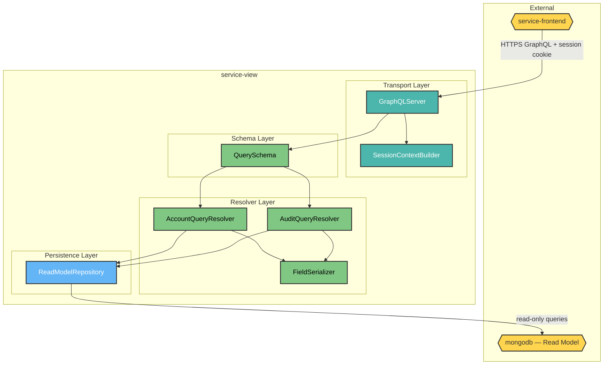
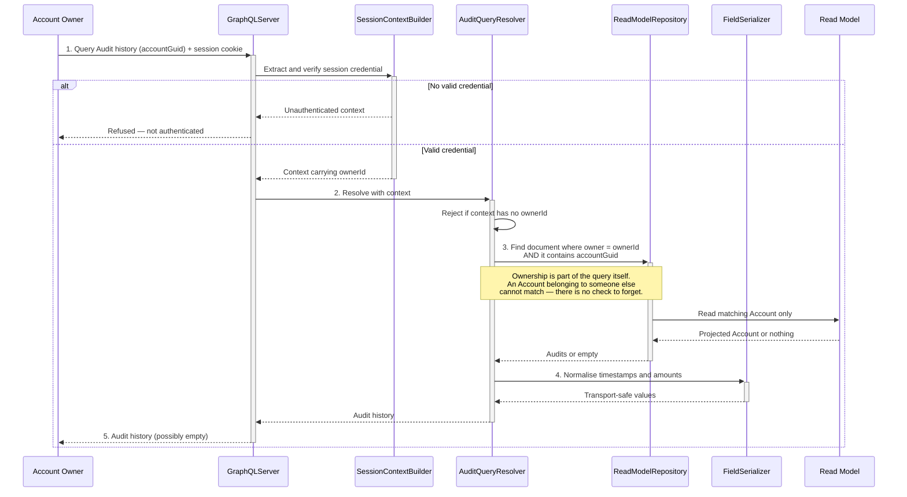

# HaboBanking - Container - View Architecture

**Status:** Draft  
**Container:** service-view

---

## Table of Contents

1. [Overview](#overview)
2. [C4 Component Level](#c4-component-level)
3. [Domain Concepts to Component Mapping](#domain-concepts-to-component-mapping)
4. [Domain Concepts](#domain-concepts)
5. [Actions](#actions)
6. [Action Sequence Diagram](#action-sequence-diagram)
7. [Use Case Coverage Mapping](#use-case-coverage-mapping)
8. [Implementation Guide](#implementation-guide)
9. [Container Risks](#container-risks)
10. [Validation](#validation)

---

## Overview

`service-view` is the customer's window onto their own money. It is the read side of the platform's CQRS split: a strictly read-only GraphQL surface over the Read Model that never writes, never publishes, and never touches the authoritative stores.

It is also, notably, **the one customer-facing container that gets authorization right**. Every query is scoped to the asserted caller by construction — the caller's identity is used as the database filter rather than being compared after the fact, so there is no code path that can return another person's Accounts.

### Container Purpose

- Expose a query surface for an Account Owner's Accounts and current Balances
- Expose the Audit history of a single Account
- Scope every query to the asserted caller, structurally rather than by check
- Serialise stored types into shapes a client can consume safely
- Hold no business rules — the Read Model is presented as found

### Container Architectural Pattern

Thin query layer over a document store:

- **Transport layer** — HTTP server, cross-origin policy, session credential extraction
- **Schema layer** — the GraphQL contract exposed to clients
- **Resolver layer** — query resolution and field serialisation
- **Persistence layer** — read-only document access

**Domain Path:** `habobanking.view`

---

## C4 Component Level



### C4 Component Overview

| Component name        | Domain Path                              | Key responsibilities                                                                                                                                                                         |
| --------------------- | ---------------------------------------- | -------------------------------------------------------------------------------------------------------------------------------------------------------------------------------------------- |
| GraphQLServer         | `habobanking.view.graphqlserver`         | Terminate HTTP, enforce the cross-origin policy, and hand each request to schema execution                                                                                                   |
| SessionContextBuilder | `habobanking.view.sessioncontextbuilder` | Extract and verify the session credential and place the asserted Account Owner identity into the request context. Establishes an unauthenticated context when no valid credential is present |
| QuerySchema           | `habobanking.view.queryschema`           | Define the query contract available to clients — the Accounts query, the Audit history query, and the shapes they return                                                                     |
| AccountQueryResolver  | `habobanking.view.accountqueryresolver`  | Resolve the caller's Accounts with their current Balances. Refuses when the context carries no identity, and filters by that identity rather than by any client argument                     |
| AuditQueryResolver    | `habobanking.view.auditqueryresolver`    | Resolve the Audit history of one Account, filtering on caller identity **and** Account Guid together, so an Account the caller does not own simply does not match                            |
| FieldSerializer       | `habobanking.view.fieldserializer`       | Convert stored representations into transport-safe values — monetary amounts to text without precision loss, and timestamps to a normalised instant format                                   |
| ReadModelRepository   | `habobanking.view.readmodelrepository`   | Execute read-only queries against the Read Model document. Performs no writes and holds no cache                                                                                             |

---

## Domain Concepts to Component Mapping

| Domain Concept | Component Name                            | Domain Path                              | Implementation Notes                                                                                                                                   |
| -------------- | ----------------------------------------- | ---------------------------------------- | ------------------------------------------------------------------------------------------------------------------------------------------------------ |
| Account        | AccountQueryResolver, ReadModelRepository | `habobanking.view.readmodelrepository`   | Read from the projected copy nested under the Account Owner document. Not authoritative — the authority is `service-transaction` and `service-account` |
| Balance        | AccountQueryResolver, FieldSerializer     | `habobanking.view.fieldserializer`       | Read as a projected amount and serialised to text so no precision is lost in transport                                                                 |
| Audit          | AuditQueryResolver, FieldSerializer       | `habobanking.view.auditqueryresolver`    | Read from the projected list nested under each Account                                                                                                 |
| Account Owner  | SessionContextBuilder                     | `habobanking.view.sessioncontextbuilder` | The Read Model document key. Never accepted from a client argument — always taken from the asserted session                                            |
| Account Type   | AccountQueryResolver                      | `habobanking.view.accountqueryresolver`  | Returned as a projected value; not validated here                                                                                                      |

---

## Domain Concepts

### Account (projected)

#### Constraints

| Constraint            | Description                                                                         |
| --------------------- | ----------------------------------------------------------------------------------- |
| Read-only             | This container never writes an Account. All changes arrive through projection       |
| Owner-scoped          | An Account is only reachable through the document of the Account Owner who holds it |
| Eventually consistent | May lag the authoritative record; a very recent change may not yet be visible       |

#### Attributes

| Attribute   | Description                   | Type        | Min | Max | Rules                                                 |
| ----------- | ----------------------------- | ----------- | --- | --- | ----------------------------------------------------- |
| accountGuid | Identity of the Account       | UUID        | —   | —   | Present on every projected Account                    |
| name        | Owner's label                 | String      | 1   | 255 | Projected as-is                                       |
| type        | Stated banking purpose        | Enumeration | —   | —   | Checking Account, Savings Account or Pension Account  |
| isFrozen    | Whether the Account is frozen | Boolean     | —   | —   | Presentational only — this container enforces nothing |
| balance     | Current amount                | Decimal     | 0   | —   | Serialised to text for transport                      |

### Audit (projected)

#### Attributes

| Attribute | Description                      | Type        | Min | Max | Rules                                              |
| --------- | -------------------------------- | ----------- | --- | --- | -------------------------------------------------- |
| auditId   | Identity of the Audit            | UUID        | —   | —   | Derived from the originating Message Id            |
| amount    | Amount moved                     | Decimal     | 0   | —   | Projected as text                                  |
| type      | Transaction Type                 | Enumeration | —   | —   | Deposit, Withdrawal, Transfer or Currency Exchange |
| timestamp | When the Transaction was applied | DateTime    | —   | —   | Normalised to a standard instant format on read    |
| sender    | Name of the sending Account      | String      | —   | 255 | May be absent for a Deposit                        |
| receiver  | Name of the receiving Account    | String      | —   | 255 | May be absent for a Withdrawal                     |

---

## Actions

| Action                 | Purpose                                                      | Authentication Required | Authorization Scope                         | Pre-conditions                                                                    | Post-conditions  | Side Effects | External Dependencies | SLA     | Idempotent | Error Handling Strategy                                                                                                                                                                                              |
| ---------------------- | ------------------------------------------------------------ | ----------------------- | ------------------------------------------- | --------------------------------------------------------------------------------- | ---------------- | ------------ | --------------------- | ------- | ---------- | -------------------------------------------------------------------------------------------------------------------------------------------------------------------------------------------------------------------- |
| GetOwnAccounts         | Return every Account the caller holds, with current Balances | **Yes**                 | Own Accounts only, enforced by construction | Session context must carry an asserted identity                                   | None — read-only | None         | MongoDB Read Model    | < 200ms | Yes        | Refuse as unauthenticated when no identity is present; return an empty result when the caller holds no Accounts                                                                                                      |
| GetAccountAuditHistory | Return the Audit history of one named Account                | **Yes**                 | Own Accounts only, enforced by construction | Session context must carry an asserted identity; an Account Guid must be supplied | None — read-only | None         | MongoDB Read Model    | < 200ms | Yes        | Refuse as unauthenticated when no identity; return an empty result when the Account is not the caller's — no distinction is made between "not yours" and "does not exist", which is the correct disclosure behaviour |

---

## Action Sequence Diagram

### Retrieve Audit history — ownership enforced by construction



---

## Use Case Coverage Mapping

| Use Case                   | API Entry Point             | Implementing Components                                                                                            | URS Requirement |
| :------------------------- | :-------------------------- | :----------------------------------------------------------------------------------------------------------------- | :-------------- |
| View Accounts and Balances | GraphQL Accounts query      | GraphQLServer + SessionContextBuilder + QuerySchema + AccountQueryResolver + ReadModelRepository + FieldSerializer | UC-AO-012       |
| Review Audit history       | GraphQL Audit history query | GraphQLServer + SessionContextBuilder + QuerySchema + AuditQueryResolver + ReadModelRepository + FieldSerializer   | UC-AO-013       |

All seven components map to at least one use case.

---

## Implementation Guide

### Solution & Project Structure

```
service-view/
├── src/
│   ├── index.ts              # GraphQLServer, SessionContextBuilder
│   ├── graphql/
│   │   ├── typeDefs.ts       # QuerySchema
│   │   └── resolvers.ts      # AccountQueryResolver, AuditQueryResolver, FieldSerializer
│   ├── mongoose/
│   │   ├── schema.ts         # ReadModelRepository document shape
│   │   └── seed.ts           # Local development seeding
│   └── types/context.ts      # Session context contract
├── tests/
├── Dockerfile
└── package.json
```

### Project Configuration Standards

| Property             | Value                                               |
| -------------------- | --------------------------------------------------- |
| Runtime              | Node.js 24                                          |
| Language             | TypeScript                                          |
| Server               | Apollo Server 5 over Express 5                      |
| Data access          | Mongoose 9 against MongoDB 7                        |
| Session verification | JSON Web Token verification against a shared secret |
| Exposed port         | 4000                                                |

### Component Wiring

Modules are imported directly; there is no injection container. The session context is built once per request by Apollo's context factory and passed to every resolver, which is the mechanism that makes owner scoping unavoidable rather than optional.

### Configuration Management

Requires the Read Model connection string, the session verification secret, the bind address and port, and the permitted cross-origin list. The cross-origin list defaults to local development origins.

### Testing Infrastructure

Unit tests cover field serialisation edge cases — instants supplied as dates, as numeric text, and as malformed values. **No test exercises the resolvers' ownership scoping**, which is unfortunate given that this is the container that implements it correctly and the behaviour most worth protecting from regression.

---

## Container Risks

| ID            | Risk                                            | Severity | Detail                                                                                                                                                                                                                                   |
| ------------- | ----------------------------------------------- | -------- | ---------------------------------------------------------------------------------------------------------------------------------------------------------------------------------------------------------------------------------------- |
| **CR-VIEW-1** | The authorization behaviour is untested         | Medium   | Owner scoping is implemented correctly but no test asserts it. A future refactor that accepted an owner identifier as a query argument would silently reintroduce the flaw that `service-account` already has, with nothing to catch it  |
| **CR-VIEW-2** | No metrics are exposed                          | Medium   | The customer-facing read path publishes no metrics, so query latency against the stated 200ms expectation cannot be observed                                                                                                             |
| **CR-VIEW-3** | Read Model staleness is invisible to the caller | Medium   | Responses carry no indication of projection lag. A customer looking at a stale Balance cannot tell it is stale, and neither can the client                                                                                               |
| **CR-VIEW-4** | No query depth or complexity limit              | Medium   | The schema nests Audits within Accounts. Without a depth, complexity or pagination limit, a single deeply nested query over an Account with a long history can be made expensive — a denial-of-service avenue common to GraphQL surfaces |
| **CR-VIEW-5** | Audit history is unbounded                      | Low      | The full Audit list for an Account is returned with no pagination. Response size grows without limit over the Account's life                                                                                                             |

---

## Validation

| Invariant | Statement                                                     | Result                                                                                                                  |
| --------- | ------------------------------------------------------------- | ----------------------------------------------------------------------------------------------------------------------- |
| INV-005   | All Components in this CA exist in the SA Container Breakdown | ✅ **Pass** — all seven components decompose `service-view`                                                             |
| INV-011   | Every entity in this CA exists in Domain Concepts             | ✅ **Pass** — Account, Balance, Audit, Account Owner and Account Type are all defined in HaboBanking-domain-concepts.md |

**Confidence: ~90%.** Small, self-contained container; resolvers and context construction were read directly.

**This artifact is in Draft status.** Review the content and set the Status to Approved when satisfied.

---

**End of Document**
